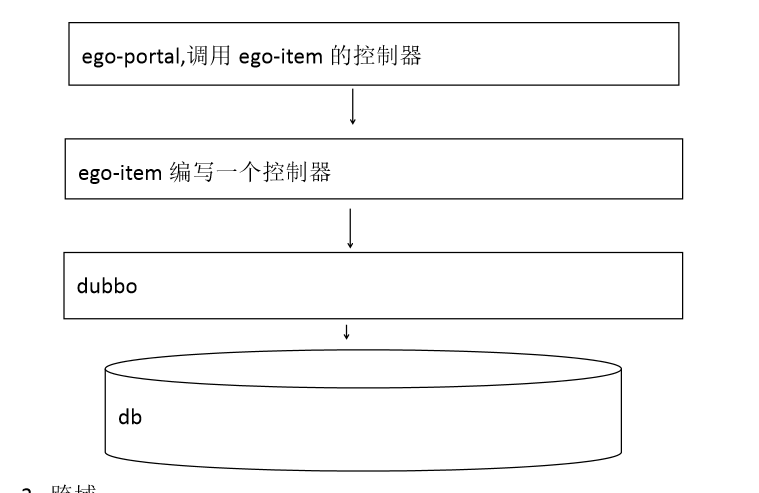
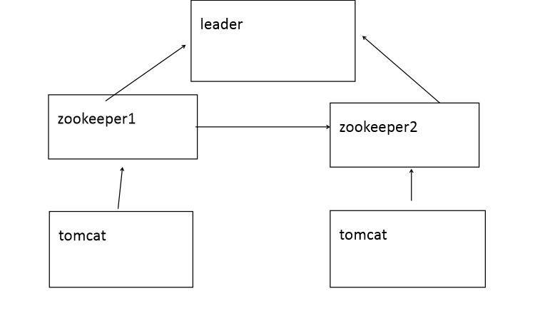
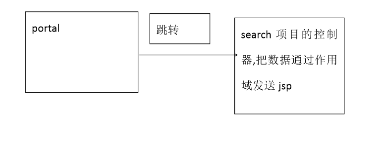
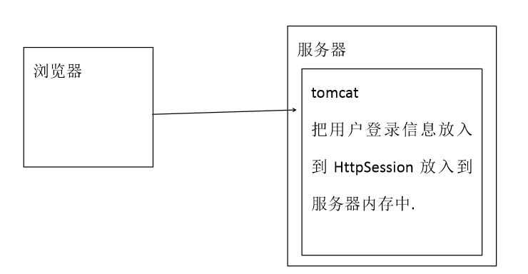
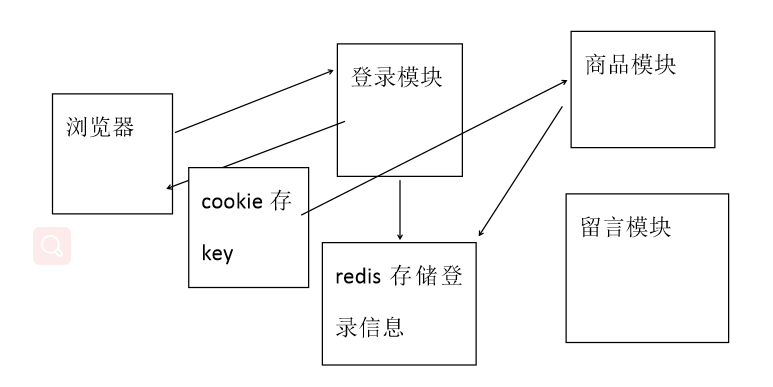
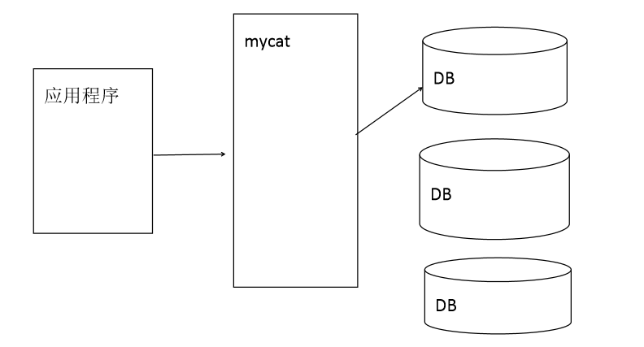

一.电商项目介绍

### 1.电商行业的几种模式

  1. B2B：企业到企业，商家到商家。代表：阿里巴巴、慧聪网
  2. B2C：商家到客户。代表：京东、淘宝商城（B2B2C）
  3. C2C：客户到客户。淘宝集市。
  4. O2O：线上到线下。

### 2.技术选型

1. Spring、SpringMVC、Mybatis
2. JSP、JSTL、jQuery、jQuery plugin、EasyUI、KindEditor（富文本编辑器）、CSS+DIV
4. Redis（缓存服务器）
5.  Solr（搜索）
6. Dubbo（调用系统服务）
7. Mysql 
8. Nginx（web 服务器）
8. jsonp 跨域数据请求格式
9. nexus maven 私服
10. MyBatis 逆向工程
11. HttpClient 使用java 完成请求及响应
12. MyCat mysql 分库分表技术

### 3.开发工具和环境

1 Eclipse
2 Maven 3.3.3
3 Tomcat 7.0.79（Maven Tomcat Plugin）
4 JDK 1.8
5 Mysql 5.7
6 Nginx 1.8.0
7 Redis 3.0.0
8 Win10 操作系统
9 Linux(服务器系统)

### 4.人员配置

4.1 产品经理：3 人，确定需求以及给出产品原型图。
4.2 项目经理：1 人，项目管理。
4.3 前端团队：5 人，根据产品经理给出的原型制作静态页面。
4.4 后端团队：20 人，实现产品功能。
4.5 测试团队：5 人，测试所有的功能。
4.7 运维团队：3 人，项目的发布以及维护。

### 5.项目周期:

 6 个月

### 6.电商结构图以及架构

1.整个电商结构图


2.基于SOA（面向服务）架构


## 二、数据库准备和逆向工程

1.直接运行Sql脚本


2.使用逆向工程生成mapper和pojo


## 三、搭建maven环境

### 1.Nexus搭建maven私服

1.为什么使用Nexus搭建maven私服？

​	1.1 公司所有开发成员没有外网,通过局域网连接nexus 私服,由私
服连接外网

​	1.2 把项目发布到私服，其他成员从私服下载，项目统一控制

2.使用私服后的maven架构图


3.搭建nexus的步骤

3.1 nexus-2.12.0-01-bundle.zip 解压到任意非中文目录中
3.2 修改nexus 端口(默认8081)

​	3.2.1 nexus-2.12.0-01\conf\nexus.properties中修改

3.3 粘贴索引库(不配置无法搜索)

​	3.3.1 先清空sonatype-work\nexus\indexer\central-ctx 内容
​	3.3.2把解压后的索引文件粘贴到这个文件夹中
3.4 进入nexus-2.12.0-01\bin\jsw\windows-x86-64(对应自己系统)
​	3.4.1 install-nexus.bat 安装服务

​	3.4.2 start-nexus.bat 安装服务

3.1 nexus-2.12.0-01-bundle.zip 解压到任意非中文目录中
3.2 修改nexus 端口(默认8081)
	1 nexus-2.12.0-01\conf\nexus.properties
3.3 粘贴索引库(不配置无法搜索)
	3.3.1 先清空sonatype-work\nexus\indexer\central-ctx 内容
	3.3.1 把解压后的索引文件粘贴到这个文件夹中
3.4 进入nexus-2.12.0-01\bin\jsw\windows-x86-64(对应自己系统)
	3.4.1 install-nexus.bat 安装服务
	3.4.2 start-nexus.bat 开启服务
	3.4.3 stop-nexus.bat 停止服务
	3.4.4 uninstall-nexus.bat 卸载服务
3.5 在浏览器输入http://localhost:8091/nexus
3.6 点击右侧log in ,输入用户名:admin,密码:admin123
3.7 在左侧搜索框中输入artifact id 测试是否配置成功

### 2.使用maven连接私服

1. 前提：把maven环境搭建

2. 在settings.xml中配置

   ​	2.1 本地仓库路径

   ```java
   <localRepository>E:/maven/repository</localRepository>
   ```

   ​	2.2 配置jdk

   ```java
   <profile> 
   		<id>jdk-1.8</id> 
   		<activation> 
   			<activeByDefault>true</activeByDefault> 
   			<jdk>1.8</jdk> 
   		</activation> 
   		<properties> 
   			<maven.compiler.source>1.8</maven.compiler.source> 
   			<maven.compiler.target>1.8</maven.compiler.target> 
   			<maven.compiler.compilerVersion>1.8</maven.compiler.compilerVersion> 
   		</properties> 
   </profile>
   ```

   ​		2.3 配置私服构建

   ```java
   <profile> 
   		<id>nexusTest</id> 
   		<repositories> 
   			<repository> 
   				<id>local-nexus</id> <url>http://127.0.0.1:8091/nexus/content/groups/publi c/</url> 
   				<releases> 
   					<enabled>true</enabled> 
   				</releases> 
   				<snapshots>
   					<enabled>true</enabled> 
   				</snapshots> 
   			</repository> 
   		</repositories> 
   	</profile>
   ```

   ​		2.4 配置让私服构建生效

   ```java
   <activeProfiles> <!--激活id 为nexusTest 的profile-->
   <activeProfile>nexusTest</activeProfile>
   </activeProfiles>
   
   ```

   ​		2.5 配置镜像maven连接私服

   ```java
   <mirror> 
   <id>nexus-releases</id> 
   <mirrorOf>*</mirrorOf>
   <url>http://localhost:8091/nexus/content/groups/public</url> 
   </mirror> 
   <mirror> 
   <id>nexus-snapshots</id> 
   <mirrorOf>*</mirrorOf>
   <url>http://localhost:8091/nexus/content/repositories/apache-snapshots/</url> 
   </mirror>
   ```

### 3.把项目发布到私服

 1. 在pom.xml中配置私服路径

    ```java
    <distributionManagement>
    		<repository>
    			<id>releases</id>
    			<url>http://localhost:8091/nexus/content/repositories/releases</url>
    		</repository>
    		<snapshotRepository>
    			<id>snapshots</id>
    			<url>http://localhost:8091/nexus/content/repositories/snapshots</url>
    		</snapshotRepository>
    	</distributionManagement>
    ```

	2. 在settings.xml中配置连接私服仓库的用户名和密码

    <server>中<id>和pom.xml 中<repository>中<id>对应

    ```java
    <servers>
    	<server>
    		<id>releases</id> 
    		<username>admin</username> 
    		<password>admin123</password> 
    	</server> 
    	<server> 
    		<id>snapshots</id> 
    		<username>admin</username> 
    		<password>admin123</password> 
    	</server>
     </servers>
    ```

## 四、创建项目

### 1.创建六个项目

1.1 ego-commons: 放工具类等
1.2 ego-manage: 后台项目
1.3 ego-parent:父项目
1.4 ego-pojo:实体类
1.5 ego-service: 服务接口
1.6 ego-service-impl: dubbo 的provider


### 2.后台页面

​	存放在ego-manage/WEB-INF中


### 3.编写访问基本页面的控制器

​	放在WEB-INF中的页面需要通过控制器访问

```java
@Controller
public class PageController {
	/**
	 * 欢迎页
	 * @return
	 */
	@RequestMapping("/")
	public String welcome() {
		return "index";
	}
	/**
	 * 根据请求路径跳转页面
	 * @param page
	 * @return
	 */
	@RequestMapping("{page}")
	public String show(@PathVariable String page) {
		return page;
	}
}
```

### 4.MyBatis分页插件

1.在mybatis.xml中配置<plugin>标签，在程序员所编写的sql命令上添加一些关于分页的信息

2.在pom.xml中配置依赖

```java
<!-- 分页插件 -->
		<dependency>
			<groupId>com.github.pagehelper</groupId>
			<artifactId>pagehelper</artifactId>
		</dependency>
```

3.在dubbo服务方创建mybatis.xml并配置插件信息

```java
<?xml version="1.0" encoding="UTF-8"?>
<!DOCTYPE configuration
  PUBLIC "-//mybatis.org//DTD Config 3.0//EN"
  "http://mybatis.org/dtd/mybatis-3-config.dtd">
<configuration>
	<plugins>
		<!-- mybatis规定所有插件必须实现interceptor接口 -->
		<plugin interceptor="com.github.pagehelper.PageHelper">
			<!-- 指定使用的数据库 -->
			<property name="dialect" value="mysql" />
		</plugin>
	</plugins>
</configuration>
```

4.在application.xml中加载mybatis.xml文件

```java
 <!-- SqlSessionFactory -->
    <bean id="factory" class="org.mybatis.spring.SqlSessionFactoryBean">
    	<property name="configLocation" value="classpath:mybatis.xml"></property>
    	<property name="dataSource" ref="dataSource"></property>
    	<property name="typeAliasesPackage" value="com.ego.pojo"></property>
    </bean>
```

5.代码示例

​	5.1 注意：PageHelper.startPage(page,rows);必须声明在执行sql之前

```java
@Override
	public EasyUIDataGrid show(int page, int rows) {	
		//分页设置
		PageHelper.startPage(page,rows);
		//查询全部
		List<TbItem> list = tbItemMapper.selectByExample(new TbItemExample());
		//分页代码
		//设置分页条件
		PageInfo<TbItem> pi = new PageInfo<TbItem>(list);
		//将分页信息放入实体类中
		EasyUIDataGrid dataGrid = new EasyUIDataGrid();
		dataGrid.setRows(pi.getList());
		dataGrid.setTotal(pi.getTotal());
		return dataGrid;
	}
```

## 五、商品功能

### 1.商品分页显示功能

1.在ego-commons中创建easyuidatagrid实体类作为返回前端的数据格式

​	1.1 注意：easyui中规定返回前端的对象必须实现Seriallizable接口

```java

public class EasyUIDataGrid implements Serializable {
	private List<?> rows;
	private long total;
    //get&set...
```

2.在ego-service中创建接口

```java
public interface TbItemDubboService {
	/**
	 * 商品分页查询
	 * @param page
	 * @param rows
	 * @return
	 */
	EasyUIDataGrid show(int page,int rows);
```

3.在ego-service-impl中编写功能

```java
@Override
	public EasyUIDataGrid show(int page, int rows) {	
		//分页设置
		PageHelper.startPage(page,rows);
		//查询全部
		List<TbItem> list = tbItemMapper.selectByExample(new TbItemExample());
		//分页代码
		//设置分页条件
		PageInfo<TbItem> pi = new PageInfo<TbItem>(list);
		//将分页信息放入实体类中
		EasyUIDataGrid dataGrid = new EasyUIDataGrid();
		dataGrid.setRows(pi.getList());
		dataGrid.setTotal(pi.getTotal());
		return dataGrid;
	}
```

4.在ego-service-impl 中applicationContext-dubbo.xml 配置接口，这样才能将服务到注册中心注册

```java
<!-- 商品类服务 -->
	<dubbo:service interface="com.ego.dubbo.service.TbItemDubboService" ref="tbItemDubboServiceImpl"></dubbo:service>
	<bean id="tbItemDubboServiceImpl" class="com.ego.dubbo.service.impl.TbItemDubboServiceImpl"></bean>
```

5.编写Test 类运行dubbo 服务

```java
public class Test {
	public static void main(String[] args) {
		Main.main(args);
	}
}
```

6.在ego-manage 添加TbItemService 及实现类

```java
public interface TbItemService {
	 EasyUIDataGrid show(int page,int rows);
```

```java
@Override
	public EasyUIDataGrid show(int page, int rows) {
		return tbItemDubboServiceImpl.show(page, rows);
	}
```

7.编写控制器

```java
@RequestMapping("item/list")
@ResponseBody
public EasyUIDataGrid show(int page,int rows) {
    return tbItemServiceImpl.show(page, rows);
}
```

### 2.商品上架、下架、删除

> 只需要修改数据库TbItem表的对应status字段的值即可
>
> 需要创建一个公共类方便前后端交互，返回状态码

1.在ego-service 中TbItemDubboService 接口及实现类添加

```java
/**
	 * 根据商品编号修改商品状态
	 * @param item
	 * @return
	 */
	int updateItemStatus(TbItem item);
```

```java
@Override
	public int updateItemStatus(TbItem item) {
		return tbItemMapper.updateByPrimaryKeySelective(item);
	}
```

2.在ego-commons中创建EgoResult类作为前后端交互的公共类，返回状态码及提示信息

```java
**
 * java代码与jsp交互的公共类
 * @author hl43674824
 *
 */
public class EgoResult {
	private int status;
	private String data;
    //get&set...
```


2.在ego-manage的TbItemservice接口以及实现类中添加

```java
 /**
	  * 批量修改商品状态
	  * @param ids
	  * @param status
	  * @return
	  */
	 int update(String ids,byte status);
```

```java
@Override
	public int update(String ids, byte status) {
		TbItem item = new TbItem();
        //多个商品编号之间用逗号隔开
		String[] split = ids.split(",");
		int index = 0;
		for (String string : split) {
			item.setId(Long.parseLong(string));
			item.setStatus(status);
			tbItemDubboServiceImpl.updateItemStatus(item);
			index += 1;
		}
		if (index == split.length) {
			return 1;
		}
		return 0;
	}

```

3.编写控制器

```java
/**
	 * 商品删除
	 * @param ids
	 * @return
	 */
	@RequestMapping("rest/item/delete")
	@ResponseBody
	public EgoResult delete(String ids) {
		int index = tbItemServiceImpl.update(ids, (byte)3);
		EgoResult res = new EgoResult();
		if(index > 0) {
			res.setStatus(200);
		}
		return res;
	}
	/**
	 * 商品下架
	 * @param ids
	 * @return
	 */
	@RequestMapping("rest/item/instock")
	@ResponseBody
	public EgoResult instock(String ids) {
		int index = tbItemServiceImpl.update(ids, (byte)2);
		EgoResult res = new EgoResult();
		if(index > 0) {
			System.out.println(index);
			res.setStatus(200);
		}
		return res;
	}
	/**
	 * 商品上架
	 * @param ids
	 * @return
	 */
	@RequestMapping("/rest/item/reshelf")
	@ResponseBody
	public EgoResult reshelf(String ids) {
		int index = tbItemServiceImpl.update(ids, (byte)1);
		EgoResult res = new EgoResult();
		if(index > 0) {
			res.setStatus(200);
		}
		return res;
	}
```

### 3.商品类名的显示

> 每次请求返回的是以当前请求父节点查询所有孩子节点（不包含子孙）的对应信息集合

1.在ego-service中TbItemCatServiceImpl接口及实现类类中添加

```java
public interface TbItemCatDubboService {
	/**
	 * 显示当前父节点的所有孩子结点信息
	 * @param pid
	 * @return
	 */
	List<TbItemCat> show(long pid);
}
```

```java
public class TbItemCatServiceImpl implements TbItemCatDubboService {
	@Resource
	private TbItemCatMapper tbItemCatMapper;
	@Override
	public List<TbItemCat> show(long pid) {
		TbItemCatExample example = new TbItemCatExample();
		example.createCriteria().andParentIdEqualTo(pid);
		return tbItemCatMapper.selectByExample(example);
	}
}

```

2.在ego-commons中创建EasyUITree类作为返回前端的信息

```java
public class EasyUITree {
	private long id;
	private String text;
	private String state;
	//get&set...
```

3.在在ego-service-impl 中applicationContext-dubbo.xml 配置接口，将服务进行注册

```java
	<!-- 商品类目服务 -->
	<dubbo:service interface="com.ego.dubbo.service.TbItemCatDubboService" ref="tbItemCatServiceImpl"></dubbo:service>
	<bean id="tbItemCatServiceImpl" class="com.ego.dubbo.service.impl.TbItemCatServiceImpl"></bean>
```

4.在ego-manage中TbItemCatController接口及实现类中添加

```java
public interface TbItemCatService {
	/**
	 * 显示当前父节点的所有孩子结点的部分信息
	 * @param pid
	 * @return
	 */
	List<EasyUITree> show(long pid);
}
```

```java
@Service
public class TbItemCatServiceImpl implements TbItemCatService{
	@Reference
	private TbItemCatDubboService tbItemCatDubboService;
 	@Override
	public List<EasyUITree> show(long pid) {
 		//每次查询，查询指定父菜单的所有子菜单
 		List<TbItemCat> list = tbItemCatDubboService.show(pid);
 		List<EasyUITree> listTree = new ArrayList<>();
 		for (TbItemCat cat : list) {
 			EasyUITree tree = new EasyUITree();
 			tree.setId(cat.getId());
 			tree.setText(cat.getName());
 			tree.setState(cat.getIsParent()?"closed":"open");
 			listTree.add(tree);
		}
		return listTree;
	}
}
```

5.编写controller

```java
@Controller
public class TbItemCatController {
	@Autowired
	private TbItemCatService tbItemCatService;
	/**
	 * 显示商品类目
	 * @return
	 */
	@RequestMapping("item/cat/list")
	@ResponseBody
	public List<EasyUITree> showItemList(@RequestParam(defaultValue = "0")long id) {
		return tbItemCatService.show(id);
	}
}

```

### 4.商品新增-图片上传

1. 需要在 linux 中安装 vsftpd,安装后实现使用 ftpclient 完成图片上传
    功能.

2.  在 vsftpd 所在服务器安装 nginx,实现图片回显

3.  在 ego-commons中 pom.xml 引入 ftpclient 的 jar 

  ```java
  <!--ftpclient -->
  		<dependency>
  			<groupId>commons-net</groupId>
  			<artifactId>commons-net</artifactId>
  		</dependency>
  ```

4.在 ego-commons 中 com.ego.commons.utils 添加两个工具类


5.在 ego-commons 中 src/main/resources 下新建 commons.properties （软编码，便于后期维护）

```java
ftpClient.host=192.168.182.131
ftpClient.port=21
ftpClient.username=ftpuser
ftpClient.password=ftpuser
ftpClient.basePath=/home/ftpuser
ftpClient.filePath=/
```

6.在 ego-manage 的 applicationContext-spring 中添加属性文件扫描

```java
<!-- 扫描配置文件 -->
		<context:property-placeholder location="classpath*:ftp.properties"/>
```

7.在 ego-manage 中 PicService 接口及实现类

​	7.1 方法返回值使用Map的原因

​	jsp中使用kindeditor的多文件上传插件，要求返回值为固定格式，且成功和失败返回值内容不一样

```java
//成功时
{
        "error" : 0,
        "url" : "http://www.example.com/path/to/file.ext"
}
//失败时
{
        "error" : 1,
        "message" : "错误信息"
}
```


7.在ego-service中TbItemService中及其实现类中添加

```
/**
	 * 新增商品和商品描述，考虑事务回滚
	 * @param item
	 * @param desc
	 * @return
	 */
	public int insTbItemDesc(TbItem item,TbItemDesc desc) throws Exception;
```

8.在 ego-manage 中新建 PicController

```java
@Controller
public class PicController {
	@Autowired
	private PicService picService;
	@RequestMapping("pic/upload")
	@ResponseBody
	public Map<String,Object> upload(MultipartFile uploadFile){
		return picService.upload(uploadFile);
	}
}
```

八、实现商品新增

1. 在 ego-service 中 TbItemDubboService 接口及实现类添加

   1.1 在实现类中手动抛出检查型异常目的：

   ​	1.1.1 出错时继续运行

   ​	1.1.2 完成dubbo中provider和consumer交互问题

   ​	1.1.3 可以自定义异常信息，方便与前端进行交互

   ```java
   /**
   	 * 新增商品和商品描述，考虑事务回滚
   	 * @param item
   	 * @param desc
   	 * @return
   	 */
   	public int insTbItemDesc(TbItem item,TbItemDesc desc) throws Exception;
   ```

   ```java
   /**
   	 * 方法不抛出检查型异常就不必设置 rollbackFor。
   	 * 发生运行时异常会自动触发事务回滚，不需要设置rollbackfor
   	 */
   	@Override
   	public int insTbItemDesc(TbItem item, TbItemDesc desc) throws Exception {
   		int index = 0;
   		try {
   			index = tbItemMapper.insertSelective(item);
   			index += tbItemDescMapper.insertSelective(desc);
   		} catch (Exception e) {
   			e.printStackTrace();
   		}
   		if(index == 2) {
   			return 1;
   		}else {
   			//自定义抛出异常可以自定义异常信息
   			throw new Exception("新增失败，事务回滚");
   		}
   	}
   ```

2.在 ego-service-impl 的 applicationContext.xml 中添加回滚

​	2.1注意：

​		1）方法抛出检查型异常就需要设置 rollbackFor捕获，进行事务回滚

​		2）发生运行时异常会自动触发事务回滚，不需要设置rollbackfor

```java
 <!-- 声明式事务 -->
    <tx:advice id="txAdvice" transaction-manager="txManage">
    	<tx:attributes>
    		<tx:method name="ins*" rollback-for="java.lang.Exception"/>
    		<tx:method name="del*"/>
    		<tx:method name="upd*"/>
    		<tx:method name="*" read-only="true"/>
    	</tx:attributes>
    </tx:advice>
```

3. 在 ego-manage 中 TbItemService 及实现类添加方法

   ```java
   /**
   	  * 新增商品信息以及商品描述
   	  * @param item
   	  * @param desc
   	  * @return
   	  * @throws Exception
   	  */
   	 int insTbItem(TbItem item,String desc) throws Exception;
   }
   ```

   ```java
   
   	@Override
   	public int insTbItem(TbItem item, String desc) throws Exception {
   		//考虑事务回滚
   		long id = IDUtils.genItemId();
   		item.setId(id);
   		Date date = new Date();
   		item.setStatus((byte)1);
   		item.setCreated(date);
   		item.setUpdated(date); 	
   		
   		TbItemDesc itemDesc = new TbItemDesc();
   		itemDesc.setItemId(id);
   		itemDesc.setCreated(date);
   		itemDesc.setUpdated(date);
   		itemDesc.setItemDesc(desc);
   		
   		return tbItemDubboServiceImpl.insTbItemDesc(item, itemDesc);
   	}
   ```

   4.编写controller

   ​	4.1在控制器捕获异常获取异常信息返回给前端

   ```java
   @RequestMapping("item/save")
   	@ResponseBody
   	public EgoResult save(TbItem item,String desc) {
   		EgoResult result = new EgoResult();
   		int index = 0;
   		try {
   			index = tbItemServiceImpl.insTbItem(item, desc);
   			if(index > 0) {
   				result.setStatus(200);
   			}
   		} catch (Exception e) {
   			result.setData(e.getMessage());
   			e.printStackTrace();
   		}
   		System.out.println(result.getData());
   		return result;
   	}
   ```

   5. 在 item-add.jsp 中修改了,添加错误信息提示

   ```java
   $.post("/item/save",$("#itemAddForm").serialize(), function(data){
   			if(data.status == 200){
   				$.messager.alert('提示','新增商品成功!');
   			}else{
   				$.messager.alert('提示','新增商品失败!<br/>错误信息：'+data.data);
   			}
   		});
   ```

### 5.规格参数

#### 5.1 规格参数管理表设计思想-json数据格式存储

1.1 需求：

​	1.1.1 每个分类有不同的分类模板

​	1.1.2 根据模板每个商品有具体信息

1.2传统表设计


​	1.2.1缺点：表关系相对复杂，数据库操作不方便

1.3 数据库优化设计

​	1.3.1 前提：group和子项的对应关系时比较灵活的

​	1.3.2 商品-子项表数据比较多

1.4 优化后：

​	1.4.1 所有的规格参数模板都设置到一个列中，这个列存储特定格式（json格式）的数据。也就是将group和其子项转换为json格式存储到类别表的某个字段中，**存储和取出都保持一致的格式**，就可以保证数据的完整和一致性

​	1.4.2 设置商品-子项表中的某个字段也按json数据格式存储。目的是存储每个商品具体的规格信息。**每个商品的规格信息参数与其对应的模板可以在新增商品时根据商品的类目进行绑定**。

#### 5.2 规格参数查询及显示

1.因为前端页面中规格参数的显示字段包含了类目的名字，因此需要对类目表进行查询

​	1.1 在 在 ego-service 中 TbItemCatDubboService 及实现类添加

```java
/**
	 * 根据id查询商品类目
	 * @param id
	 * @return
	 */
	TbItemCat selById(long id);
```

```java
	@Override
	public TbItemCat selById(long id) {
		return tbItemCatMapper.selectByPrimaryKey(id);
	}
```

2.在 ego-service 新建 TbItemParamDubboService 及实现类

​	2.1 逆向工程中设定只有带有 withBlobs()的方法会查询 text 类型的列 ，为了提升与数据库交互的效率

```java
/**
	 * 分页显示商品规格参数页面
	 * @param page
	 * @param rows
	 * @return
	 */
	EasyUIDataGrid showPage(int page,int rows);
```

```java
	@Override
	public EasyUIDataGrid showPage(int page, int rows) {
		//设置分页条件
		PageHelper.startPage(page, rows);
		//执行查询
		//当数据库字段中带有一个或多个text类型的字段时，逆向工程会自动生成xxxWithBloBs方法
		//因为text表示为大文本数据，访问效率较慢，为提升效率，因此只有带有xxxWithBloBs的方法才会对text字段操作
		List<TbItemParam> list = tbItemParamMapper.selectByExampleWithBLOBs(new TbItemParamExample());
		//将查询结果封装到分页信息
		PageInfo<TbItemParam> pi = new PageInfo<>(list);
		//获取到相应的返回信息
		EasyUIDataGrid dataGrid = new EasyUIDataGrid();
		dataGrid.setRows(pi.getList());
		dataGrid.setTotal(pi.getTotal());
		return dataGrid;
	}
```

3. 在 ego-service-impl 的 applicationContext-dubbo.xml 注册服务接口

   ```java
   <!-- 规格参数模板 -->
   	<dubbo:service interface="com.ego.dubbo.service.TbItemParamDubboService" ref="tbItemParamDubboServiceImpl"></dubbo:service>
   	<bean id="tbItemParamDubboServiceImpl" class="com.ego.dubbo.service.impl.TbItemParamDubboServiceImpl"></bean>
   ```

4. 在ego-manage中新建com.ego.manage.pojo.TbItemParamChild,

  4.1作用:**封装 jsp 中要的所有数据**

  ```java
  
  public class TbItemParamChild extends TbItemParam implements Serializable{
  	private String itemCatName;
      //get&&set...
  ```

5.在 ego-manage 中新建 TbItemParamService 及实现类

```java
/**
	 * 分页显示规格参数信息
	 * @param page
	 * @param rows
	 * @return
	 */
	EasyUIDataGrid showPage(int page,int rows);
```

```java
@Override
	public EasyUIDataGrid showPage(int page, int rows) {
		EasyUIDataGrid dataGrid = tbItemParamDubboServiceImpl.showPage(page, rows);
		List<TbItemParam> rows2 = (List<TbItemParam>) dataGrid.getRows();
		List<TbItemParamChild> list = new ArrayList<TbItemParamChild>();
		for (TbItemParam tbItemParam : rows2) {
			TbItemParamChild child = new TbItemParamChild();
			child.setId(tbItemParam.getId());
			child.setItemCatId(tbItemParam.getItemCatId());
			child.setItemCatName(tbItemCatDubboServiceImpl.selById(tbItemParam.getItemCatId()).getName());
			child.setParamData(tbItemParam.getParamData());
			child.setCreated(tbItemParam.getCreated());
			child.setUpdated(tbItemParam.getUpdated());
			list.add(child);
		}
		dataGrid.setRows(list);
		return dataGrid;
	}
```

6.在 ego-manage 中新建 TbItemParamController 

```java
/**
	 * 分页显示商品规格参数
	 * @param page
	 * @param rows
	 * @return
	 */
	@RequestMapping("item/param/list")
	@ResponseBody
	public EasyUIDataGrid showPage(int page,int rows) {
		return tbItemParamServiceImpl.showPage(page, rows);
	}
```

5.2 规格参数的批量删除

1. 在 ego-service 的 TbItemParamDubboService 及实现类添加 

   ```java
   /**
   	 * 批量删除商品规格参数
   	 * @param ids
   	 * @return
   	 */
   	int delByIds(String ids) throws Exception;
   ```

   ```java
   @Override
   	public int delByIds(String ids) throws Exception {
   		String[] split = ids.split(",");
   		int index = 0;
   		for (String string : split) {
   			index += tbItemParamMapper.deleteByPrimaryKey(Long.parseLong(string));
   		}
   		if(index == split.length) {
   			return 1;
   		}else {
   			throw new Exception("删除失败。可能原因：删除信息已不存在");
   		}
   	}
   ```

2. 在 ego-service-impl 的 applicationContext.xml 中添加 rollback-for

   

3.在 ego-manage 的 TbItemParamService 及实现类添加 

```java
/**
	 * 批量删除规格参数
	 * @param ids
	 * @return
	 */
	EgoResult delByIds(String ids);
```

```java
@Override
	public EgoResult delByIds(String ids) {
		EgoResult er = new EgoResult();
		int index = 0;
		try {
			index = tbItemParamDubboServiceImpl.delByIds(ids);
			if(index == 1) {
				er.setStatus(200);
			}
		} catch (Exception e) {
			e.printStackTrace();
			er.setData("删除失败，错误提示：<br/>"+e.getMessage());
		}
		return er;
	}
```

4.在 ego-manage 的 TbItemParamController 添加 

```
/**
	 * 批量删除商品规格参数
	 * @param ids
	 * @return
	 */
	@RequestMapping("item/param/delete")
	@ResponseBody
	public EgoResult delByIds(String ids) {
		return tbItemParamServiceImpl.delByIds(ids);
	}
```

#### 5.3 规格参数模板新增

1.先对新增所选的类目进行查询，是否已经存在，若果存在则无法新增规格参数模板

​	1.1 在 ego-service 的 TbItemParamDubboService 及实现类添加 

```java
/**
	 * 根据类目id查询规格参数-验证此类目所对应的模板信息是否存在
	 * @param id
	 * @return
	 */
	TbItemParam selById(long catId);
```

```java
@Override
	public TbItemParam selById(long id) {
		TbItemParamExample example = new TbItemParamExample();
		example.createCriteria().andItemCatIdEqualTo(id);
		List<TbItemParam> itemParam = tbItemParamMapper.selectByExampleWithBLOBs(example);
		if(itemParam != null && itemParam.size() > 0) {
			//前提：一个商品类目只能对应一个规格参数模板
			return itemParam.get(0);
		}
		return null;
	}
```

​	1.2  在 ego-manage 的 TbItemParamService 及实现类添加 

```java
/**
	 * 根据商品类目id查询商品规格参数
	 * @param id
	 * @return
	 */
	EgoResult selByCatId(Long id);
```

```java
@Override
	public EgoResult selByCatId(Long id) {
		EgoResult er = new EgoResult();
		TbItemParam itemParam = tbItemParamDubboServiceImpl.selById(id);
		if(itemParam != null) {
			er.setStatus(200);
			er.setData(itemParam);
		}
		return er;
	}
```

​	1.3在 ego-manage 的 TbItemParamController 添加

```java
/**
	 * 根据商品类目id查询商品规格信息
	 * @param id
	 * @return
	 */
	@RequestMapping("item/param/query/itemcatid/{catId}")
	@ResponseBody
	public EgoResult selByCatId(@PathVariable Long catId) {
		return tbItemParamServiceImpl.selByCatId(catId);
	}
```

2.前端对新增的规格参数模板进行json格式的转换，传递给控制器

​	2.1在 ego-service 中 TbItemParamDuboService 及实现类添加

```java
	/**
	 * 新增商品规格参数
	 * @param param
	 * @return
	 */
	int insItemParam(TbItemParam param);
```

```java
@Override
	public int insItemParam(TbItemParam param) {
		return tbItemParamMapper.insertSelective(param);
	}

```

​	2.2  在 ego-manage 的 TbItemParamService 及实现类添加 

```java
	/**
	 * 新增商品规格参数
	 * @param param
	 * @return
	 */
	EgoResult insItemParam(TbItemParam param);
```

```java
@Override
	public EgoResult insItemParam(TbItemParam param) {
		EgoResult er = new EgoResult();
		//如果没有参数规格参数信息，直接返回
		if(param.getParamData().equals("[]")) {
			return er;
		}
		Date date = new Date();
		param.setCreated(date);
		param.setUpdated(date);
		int index = tbItemParamDubboServiceImpl.insItemParam(param);
		if(index > 0) {
			er.setStatus(200);
		}
		return er;
	}
```

​	2.3在 ego-manage 的 TbItemParamController 中添加 

```java
@RequestMapping("item/param/save/{catId}") 
	@ResponseBody
	public EgoResult save(TbItemParam param,@PathVariable long catId) {
		param.setItemCatId(catId);
		return tbItemParamServiceImpl.insItemParam(param);
	}
```

#### 5.4  商品新增时同时新增商品规格参数信息

1. 在 ego-service 的 TbItemDubboService 及实现类修改如下 

   ```java
   public int insTbItemDesc(TbItem item,TbItemDesc desc,TbItemParamItem paramItem) throws Exception;
   ```

   ```java
   @Override
   	public int insTbItemDesc(TbItem item, TbItemDesc desc,TbItemParamItem paramItem) throws Exception {
   		int index = 0;
   		try {
   			index += tbItemMapper.insertSelective(item);
   			index += tbItemDescMapper.insertSelective(desc);
   			index += tbItemParamItemMapper.insertSelective(paramItem);
   		} catch (Exception e) {
   			e.printStackTrace();
   		}
   		if(index == 3) {
   			return 1;
   		}else {
   			//自定义抛出异常可以自定义异常信息
   			throw new Exception("新增失败，事务回滚");
   		}
   	}
   ```

   2. 在 ego-manage 中 TbItemService 及实现类修改如下 

   ```java
    /**
   	  * 新增商品信息以及商品描述以及规格参数
   	  * @param item
   	  * @param desc
   	  * @return
   	  * @throws Exception
   	  */
   	 int insTbItem(TbItem item,String desc,String itemParams) throws Exception;
   ```

   ```java
   @Override
   	public int insTbItem(TbItem item, String desc,String itemParams) throws Exception {
   		
   		//考虑事务回滚
   		long id = IDUtils.genItemId();
   		item.setId(id);
   		Date date = new Date();
   		item.setStatus((byte)1);
   		item.setCreated(date);
   		item.setUpdated(date); 	
   		
   		TbItemDesc itemDesc = new TbItemDesc();
   		itemDesc.setItemId(id);
   		itemDesc.setCreated(date);
   		itemDesc.setUpdated(date);
   		itemDesc.setItemDesc(desc);
   		
   		TbItemParamItem paramItem = new TbItemParamItem();
   		paramItem.setParamData(itemParams);
   		paramItem.setCreated(date);
   		paramItem.setUpdated(date);
   		paramItem.setItemId(id);
   		
   		
   		return tbItemDubboServiceImpl.insTbItemDesc(item, itemDesc,paramItem);
   	}
   ```

   3. 在 ego-manage 的 TbItemController 中修改如下 

```java
/**
	 * 新增商品，包括商品信息，描述以及规格参数
	 * @param item
	 * @param desc
	 * @param itemParams
	 * @return
	 */
	@RequestMapping("item/save")
	@ResponseBody
	public EgoResult save(TbItem item,String desc,String itemParams) {
		EgoResult result = new EgoResult();
		int index = 0;
		try {
			index = tbItemServiceImpl.insTbItem(item, desc,itemParams);
			if(index > 0) {
				result.setStatus(200);
			}
		} catch (Exception e) {
			result.setData(e.getMessage());
			e.printStackTrace();
		}
		return result;
	}
```

## 六、门户

### 1.门户导航菜单

#### 	1.1门户导航菜单功能需求分析

​		1）在 ego-portal 中显示 tb_item_cat 商品类目的数据,让 ego-portal 调用 ego-item 中的数据,由 ego-item 调用 dubbo



​		2） 一个 Servlet 容器(tomcat)中项目调用另一个 servlet 容器(tomcat)中项目,称为跨域

​		3）ajax在研发时出于安全性考虑不允许跨域请求字符串流或json数据

​			解决办法：

​					（1）使用jsonp

​					（2）由ego-protal请求自己的控制器，控制器请求自己的service，在service中使用httpClient发送跨域请求，调用ego-item中的控制器方法

#### 2.jsonp

 1. jsonp：跨域ajaxs数据请求的解决方案

 2. 发展由来

    2.1 ajax不能进行跨域请求（如果ajax请求的控制器返回的是字符流或json数据，则不能接收）

    2.2 发现可以在一个项目中跨域直接访问另一个项目的js文件。

    2.3 使用ajax访问控制器，控制器将返回的数据伪装成js文件格式

 3. 使用jsonp时服务器端返回的数据格式

    ```java
    函数名(返回的数据)
    ```

4.在客户端编写代码

​	4.1 dataType：表示客户端接收的数据格式，一定要设置成jsonp

​	4.2 jsonp：传递给服务器的参数名。省略时默认为callback

​	4.3 jsonCallBack：传递给服务器参数对应的值，表示最终回调的函数名。省略时默认：jquery+一堆数字

​	4.4 如果直接使用success:function()对jsonpCallBack没有要求，如果将回调的函数声明在外部，则必须保证jsonpCallBack和function的名称相同

```javascript
$(function(){
	$("button").click(function(){
        $.ajax({
            url:'http://localhost:9002/demo2',
            type:'post',
            dataType:'jsonp',
            jsonpCallback:'ab12312321c',
            jsonp:'callback',
            success:function(data){
           		alert(data+"success");
			}
		});
	})
})

```

​	5.在服务器端添加代码

​		5.1 使用spring对jackson封装类MappingJacksonValue,帮助我们完成jsonp数据格式的拼接

```java
@Controller
public class DemoController {
    @RequestMapping("demo3")
    @ResponseBody
    public MappingJacksonValue demo(String callback){
        People p = new People();
        p.setId(1);
        p.setName("张三");
        //把构造方法参数转换为json 字符串并当作最终返回值函数
        的参数
        MappingJacksonValue mjv = new
        MappingJacksonValue(p);
        //最终返回结果中函数名
        mjv.setJsonpFunction(callback);
        return mjv;
    }
}

```

#### 3.搭建ego-protal和ego-item

1. 环境与ego-manage相同
2. ego-protal的端口8082，ego-item的端口是8081
3. 修改applicationContext-dubbo.xml注解扫描

#### 4.编写ego-item代码

1.在ego-item中新建con.ego.item.pojo.PortalMenu

​	1.1 最终ego-item返回给ego-portal的jsonp数据中函数的参数值

```java
/**
 * protal最终要的数据格式
 * @author hl43674824
 *
 */
public class PortalMenu {
	private Object data;
```

2.在ego-item中新建com.ego.item.pojo.PortalMenuNode

​	2.1 如果菜单是父菜单，当前菜单的数据都封装到这个类中

```java
/**
 * 父菜单结点类型
 * @author hl43674824
 *
 */
public class PortalMenuNode {
	private String u;
	private String n;
	private Object i;
```

3.在ego-item 中新建com.ego.item.service.TbItemCatService 及实现类

```java
public interface TbItemCatService {
	/**
	 * 查询出所有分类类目，并转换为特定类型
	 * @return
	 */
	PortalMenu showCatMenu(); 
}
```

```java
@Service
public class TbItemCatServiceImpl implements TbItemCatService {
	@Reference
	private TbItemCatDubboService tbItemCatDubboServiceImpl;

	@Override
	public PortalMenu showCatMenu() {
		// 查询出所有一级菜单
		List<TbItemCat> list = tbItemCatDubboServiceImpl.show(0);
		List<Object> portalList = selAllMenu(list);
		PortalMenu menu = new PortalMenu();
		menu.setData(portalList);
		return menu;
	}

	private List<Object> selAllMenu(List<TbItemCat> list) {
		List<Object> portalList = new ArrayList<>();
		for (TbItemCat itemCat : list) {
			if (itemCat.getIsParent()) {
				PortalMenuNode node = new PortalMenuNode();
				node.setU("/products/" + itemCat.getId() + ".html");
				node.setN("<a href='/products/" + itemCat.getId() + ".html'>" + itemCat.getName() + "</a>");
				node.setI(selAllMenu(tbItemCatDubboServiceImpl.show(itemCat.getId())));
				portalList.add(node);
			} else {
				portalList.add("/products/" + itemCat.getId() + ".html|" + itemCat.getName());
			}
		}
		return portalList;
	}
}

```

3.在ego-item中新建控制器com.ego.item.controller.TbItemCatController

```java
@Controller
public class TbItemCatController {
	@Resource
	private TbItemCatService tbItemCatServiceImpl;
	/**
	 * 返回jsonp数据格式，包含所有菜单信息
	 * @param callback
	 * @return
	 */
	@RequestMapping("rest/itemcat/all")
	@ResponseBody
	public MappingJacksonValue showMenu(String callback) {
		MappingJacksonValue mjv = new MappingJacksonValue(tbItemCatServiceImpl.showCatMenu());
		mjv.setJsonpFunction(callback);
		return mjv;
	}
}
```

### 2.大广告轮播后台数据处理

1.分析门户大广告需求

在控制器中按照通过request作用域按照固定的json格式将数据传递给jsp

2.缓存运行图


3.实现门户大广告显示（添加缓存）

第一次从数据中查询对应广告信息，然后将其放入redis缓存中，以后从缓存中拿，后台对数据进行更新时，需要将同步到缓存

1）在ego-service的TbContentService及其实现类中添加

```java
/**
	 * 查询出前n个内容
	 * @param count
	 * @param isSort 是否将其排序
	 * @return
	 */
	List<TbContent> selByCount(int count,boolean isSort);
```

```java
@Override
	public List<TbContent> selByCount(int count, boolean isSort) {
		TbContentExample example = new TbContentExample();
		if(isSort) {
			example.setOrderByClause("updated desc");
		}
		if(count != 0) {
			PageHelper.startPage(1, count);
			List<TbContent> list = tbContentMapper.selectByExampleWithBLOBs(example);
			PageInfo<TbContent> pageInfo = new PageInfo<TbContent>(list);
			return pageInfo.getList();
		}else {
			return tbContentMapper.selectByExampleWithBLOBs(example);
		}
	}
```

2）新建ego-redis项目，在pom.xml中依赖jedis和spring的jar

3）导入applicationContext-jedis.xml，并在其中添加注解扫描，目的是将配置文件中的jedisCluster注入到dao层实现类中


4）新建redis.properties，在其中添加大广告的key


5）在ego-redis中新建JedisDao及其实现类

```java
public interface JedisDao {
	boolean exists(String key);
	String set(String key,String value);
	String get(String key);
	long del(String key);
}
```

```java
@Repository
public class JedisDaoImpl implements JedisDao{
	@Resource
	private  JedisCluster jedisClients;
	@Override
	public boolean exists(String key) {
		return jedisClients.exists(key);
	}

	@Override
	public String set(String key, String value) {
		return jedisClients.set(key, value);
	}

	@Override
	public String get(String key) {
		return jedisClients.get(key);
	}

	@Override
	public long del(String key) {
		return jedisClients.del(key);
	}

}

```

6）在 ego-commons 中添加工具类 JsonUtils

7）修改 ego-portal 的 applicationContext-spring.xml 加载ego-redis中的配置文件

```java
<!-- 加载配置文件 -->
		<context:property-placeholder location="classpath*:redis.properties" />
```

8）在ego-portal的TbContentService及其实现类中添加

```java
public interface TbContentService {
	/**
	 * 查询大广告内容信息
	 * @return
	 */
	String selByCount();
}

```

```java
@Service
public class TbContentServiceImpl implements TbContentService{
	@Reference
	private TbContentDubboService tbContentDubboService;
	@Value("${redis.bigpic.key}")
	private String key;
	@Resource
	private JedisDao jedisDaoImpl;
	@Override
	public String selByCount() {
		if(jedisDaoImpl.exists(key)) {
			return jedisDaoImpl.get(key);
		}
		List<Map<String,Object>> result = new ArrayList<>();
		List<TbContent> list = tbContentDubboService.selByCount(6, true);
		for (TbContent tc : list) {
			Map<String,Object> map = new HashMap<>();
			map.put("srcB", tc.getPic2()); 
			map.put("height", 240);
			map.put("alt", "对不起,加载图片失败"); 
			map.put("width", 670); 
			map.put("src", tc.getPic());
			map.put("widthB", 550); 
			map.put("href", tc.getUrl() ); 
			map.put("heightB", 240);
			result.add(map);
		}
		String listJson = JsonUtils.objectToJson(result);
		//第一次查询时，将数据放到redis缓存中
		jedisDaoImpl.set(key, listJson);
		return listJson;
	}
}
```

9）在在 ego-portal 中新建 TbContentController ，访问首页前通过此控制器获取大广告的数据信息

```java
@Controller
public class TbContentController {
	@Resource
	private TbContentService tbContentServiceImpl;
	/**
	 * 将数据通过reques作用域传递给jsp,显示大广告
	 * @param model
	 * @return
	 */
	@RequestMapping("/showBigPic")
	public String showBigPic(Model model) {
		model.addAttribute("ad1", tbContentServiceImpl.selByCount());
		return "index";
	}
}
```


## 七、内容

### 1.内容分类查询

思路：返回一个EasyUITree保存查询的当前级别的所有菜单，每次点击父菜单，都会发送ajax请求查询当前父菜单下的一级子菜单。

1.在 ego-service 新建 TbContentCategoryDubboService 及实现类

```java

public interface TbContentCategoryDubboService {
	/**
	 * 根据父id查询所有子类目
	 * @param pid
	 * @return
	 */
	List<TbContentCategory> selByPid(long pid);
```

```java
public class TbContentCategoryDubboServiceImpl implements TbContentCategoryDubboService {
	@Resource
	private TbContentCategoryMapper tbContentCategoryMapper;
	@Override
	public List<TbContentCategory> selByPid(long pid) {
		TbContentCategoryExample example = new TbContentCategoryExample();
		example.createCriteria().andParentIdEqualTo(pid).andStatusEqualTo(1);
		return tbContentCategoryMapper.selectByExample(example);
	}
```

2.在 ego-service-impl 的 applicationContext-dubbo.xml 中注册接口

```java
<!-- 具体内容 -->
	<dubbo:service interface="com.ego.dubbo.service.TbContentDubboService" ref="tbContentDubboServiceImpl"></dubbo:service>
	<bean id="tbContentDubboServiceImpl" class="com.ego.dubbo.service.impl.TbContentDubboServiceImpl"></bean>
```

3.在 ego-manage 中新建 TbContentCategoryService 及实现类

```java
public interface TbContentCategoryService {
	/**
	 * 根据父id查询所有子类目
	 * @param pid
	 * @return
	 */
	List<EasyUITree> selByPid(long pid);
```

```java
	@Override
	public List<EasyUITree> selByPid(long pid) {
		List<TbContentCategory> list = tbContentCategoryDubboService.selByPid(pid);
		List<EasyUITree> treeList = new ArrayList<EasyUITree>();
		for (TbContentCategory cate : list) {
			EasyUITree tree = new EasyUITree();
			tree.setId(cate.getId());
			tree.setText(cate.getName());
			tree.setState(cate.getIsParent()?"closed":"open");
			treeList.add(tree);
		}
		return treeList;
	}
```

4.在 ego-manage 中新建 TbContentCategoryController 

```java
@Controller
public class TbContentCategoryController {
	@Autowired
	private TbContentCategoryService tbContentCategoryService;
	/**
	 * 显示类目信息
	 * @param id
	 * @return
	 */
	@RequestMapping("content/category/list")
	@ResponseBody
	public List<EasyUITree> showCategory(@RequestParam(defaultValue = "0")long id){
		return tbContentCategoryService.selByPid(id);
	}
	
```

### 2.内容分类新增

思路：新增子结点，判断当前级别中是否有重名，并设置父节点的属性isParent为true

1.在 ego-service 的 TbContentCategoryDubboService 及实现类添加 

```java
/**
	 * 新增类目
	 * @param cate
	 * @return
	 */
	int insCategoryBy(TbContentCategory cate,TbContentCategory parent)  throws Exception ;
	/**
	 * 修改类目信息
	 * @param cate
	 * @return
	 */
	int update(TbContentCategory parent);
```

```java
@Override
	public int insCategoryBy(TbContentCategory cate,TbContentCategory parent) throws Exception {
		int index = tbContentCategoryMapper.insertSelective(cate);
		index += tbContentCategoryMapper.updateByPrimaryKeySelective(parent);
		if(index == 2) {
			return 1;
		}else {
			throw new Exception("新增失败，失误回滚");
		}
	}
	@Override
	public int update(TbContentCategory cate) {
		return tbContentCategoryMapper.updateByPrimaryKey(cate);
	}
```

2.在 ego-manage 中 TbContentCategoryService 中添加 

```java
	/**
	 *	新增类目，包含对父类目的修改
	 * @param cate
	 * @return
	 */
	EgoResult insCategory(TbContentCategory cate);
```

3.在 ego-manage 的 TbContentCategoryController 中添加 

```java
/**
	 * 新增类目，包含修改父类目状态
	 * @param cate
	 * @return
	 */
	@RequestMapping("content/category/create")
	@ResponseBody
	public EgoResult insCategory(TbContentCategory cate) {
		return tbContentCategoryService.insCategory(cate);
	}
```

### 3.商品分类的重命名

思路：对节点进行修改，判断是否有重名，若存在，则修改失败

1. 在 ego-service 的 TbContentCategoryDubboService 及实现类添加方
法

```java
	/**
	 * 修改类目信息
	 * @param cate
	 * @return
	 */
	int update(TbContentCategory parent);
	/**
	 * 根据id查询此类目的所有信息
	 * @param cate
	 * @return
	 */
	TbContentCategory selById(long id);
```

```java
@Override
	public int update(TbContentCategory cate) {
		return tbContentCategoryMapper.updateByPrimaryKey(cate);
	}
	@Override
	public TbContentCategory selById(long id) {
		return tbContentCategoryMapper.selectByPrimaryKey(id);
	}
```

2. 在 ego-manage 中的 TbContentCategoryService 及实现类添加 

```java
	/**
	 * 根据id重命名
	 * @param id
	 * @return
	 */
	EgoResult update(TbContentCategory cate);
```

```java
public EgoResult update(TbContentCategory cate) {
		EgoResult er = new EgoResult();
		//判断是否与当前类目的节点同名
		TbContentCategory category = tbContentCategoryDubboService.selById(cate.getId());
		List<TbContentCategory> list = tbContentCategoryDubboService.selByPid(category.getParentId());
		for (TbContentCategory c : list) {
			if(c.getName().equals(cate.getName())) {
				er.setData("当前类目已存在");
				return er;
			}
		}
		category.setUpdated(new Date());
		category.setName(cate.getName());
		int index = tbContentCategoryDubboService.update(category);
		if(index > 0) {
			er.setStatus(200);
		}
		return er;
	}
```

3. 在 ego-manage 的 TbContentCategoryController 添加

```java
/**
	 * 修改类目信息
	 * @param cate
	 * @return
	 */
	@RequestMapping("content/category/update")
	@ResponseBody
	public EgoResult update(TbContentCategory cate) {
		return tbContentCategoryService.update(cate);
	}
```

### 4.商品分类的删除

思路：逻辑删除，实际上是修改某个属性的值，并判断父节点是否还有子结点，若无，则需要将它的属性isParent改为false

1.在 ego-manage 的 TbContentCategoryService 及实现类添加

```java
/**
	 * 删除类目信息
	 * @param cate
	 * @return
	 */
	EgoResult delete(TbContentCategory cate);
```

```java
@Override
	public EgoResult delete(TbContentCategory cate) {
		EgoResult er = new EgoResult();
		cate.setUpdated(new Date());
		cate.setStatus(2);
		int index = tbContentCategoryDubboService.update(cate);
		if(index > 0) {
			List<TbContentCategory> list = tbContentCategoryDubboService.selByPid(cate.getParentId());
			if(list == null || list.size() == 0) {
				TbContentCategory parent = new TbContentCategory();
				parent.setId(cate.getParentId());
				parent.setIsParent(false);
				index += tbContentCategoryDubboService.update(parent);
				if(index == 2) {
					er.setStatus(200);;
				}
			}
		}
		return er;
	}
```

2. 在 ego-manage 的 TbContentCategoryController 中添加 

```java
/**
	 * 删除类目信息，包含对父节点的修改
	 * @param cate
	 * @return
	 */
	@RequestMapping("content/category/delete")
	@ResponseBody
	public EgoResult delete(TbContentCategory cate) {
		return tbContentCategoryService.delete(cate);
	}
```

### 1.内容查询

思路：根据内容的分类id进行查询，第一次查询所有的内容

1. 在 ego-service 新建 TbContentDubboService 及实现类

```java
/**
	 * 根据类目id查询内容
	 * @param catagoryId
	 * @param page
	 * @param rows
	 * @return
	 */
	EasyUIDataGrid selByCategoryId(long catagoryId,int page,int rows);
```

```java
@Override
	public EasyUIDataGrid selByCategoryId(long categoryId, int page, int rows) {
		//设置分页条件
		PageHelper.startPage(page,rows);
		TbContentExample example = new TbContentExample();
		if(categoryId != 0) {
			example.createCriteria().andCategoryIdEqualTo(categoryId);
		}
		List<TbContent> list = tbContentMapper.selectByExampleWithBLOBs(example);
		PageInfo<TbContent> pi = new PageInfo<TbContent>(list);
		EasyUIDataGrid data = new EasyUIDataGrid();
		data.setRows(pi.getList());
		data.setTotal(pi.getTotal());
		return data;
	}
```

2. 在 ego-service-impl 中 applicationContext-dubbo.xml 注册接口

```java
<!-- 具体内容 -->
	<dubbo:service interface="com.ego.dubbo.service.TbContentDubboService" ref="tbContentDubboServiceImpl"></dubbo:service>
	<bean id="tbContentDubboServiceImpl" class="com.ego.dubbo.service.impl.TbContentDubboServiceImpl"></bean>
```

3.在 ego-manage 中新建 TbContentService 及实现类

```java
	/**
	 * 根据类目id进行查询
	 * @param categoryId
	 * @param page
	 * @param rows
	 * @return
	 */
	EasyUIDataGrid selByCategoryId(long categoryId,int page,int rows);
```

```java
	@Override
	public EasyUIDataGrid selByCategoryId(long categoryId, int page, int rows) {
		return tbContentDubboService.selByCategoryId(categoryId, page, rows);
	}
```

4. 在 ego-manage 中新建 TbContentController

```java
@RestController
public class TbContentController {
	@Resource
	private TbContentService tbContentServiceImpl;
	@RequestMapping("content/query/list")
	public EasyUIDataGrid show(long categoryId,int page,int rows) {
		return tbContentServiceImpl.selByCategoryId(categoryId, page, rows);
	}
```

### 2.内容新增

1. 在 ego-service 的 tbcontentdubboService 及实现类添加 

```java
/**
	 * 内容新增
	 * @param content
	 * @return
	 */
	int insTbContent(TbContent content);
```

```java
@Override
	public int insTbContent(TbContent content) {
		return tbContentMapper.insertSelective(content);
	}
```

2.在 ego-manage 的 TbContentService 及实现类添加

```java
	/**
	 * 新增内容
	 * @param content
	 * @return
	 */
	EgoResult insTbContent(TbContent content);
```

```java
	@Override
	public EgoResult insTbContent(TbContent content) {
		EgoResult er = new EgoResult();
		Date date = new Date();
		content.setCreated(date);
		content.setUpdated(date);
		int index = tbContentDubboService.insTbContent(content);
		if(index > 0) {
			er.setStatus(200);
		}
		return er;
	}
```

3. 在 ego-manage 的 TbContentController 添加 

```java
@RequestMapping("content/save")
	public EgoResult save(TbContent content) {
		return tbContentServiceImpl.insTbContent(content);
	}
```

#### 2.1新增时同步到redis中

1.在applicationContext-spring中修改

```java
<!-- 扫描配置文件 -->
		<context:property-placeholder location="classpath*:ftp.properties,classpath*:redis.properties"/>
```

2.在TbContentServiceImpl中修改，当新增成功时，判断redis中是否存在数据，若存在，取出转换为list，然后再前面加上此条新增的数据

```java
	@Override
	public EgoResult insTbContent(TbContent content) {
		EgoResult er = new EgoResult();
		Date date = new Date();
		content.setCreated(date);
		content.setUpdated(date);
		int index = tbContentDubboService.insTbContent(content);
		if (index > 0) {
			er.setStatus(200);
			// 后台新增时将数据同步到redis中
			if(jedisDaoImpl.exists(key)) {
				String string = jedisDaoImpl.get(key);
				if(string != null && !string.equals("")) {
					List<HashMap> list = JsonUtils.jsonToList(string, HashMap.class);
					HashMap<String, Object> map = new HashMap<>();
					map.put("srcB", content.getPic2());
					map.put("height", 240);
					map.put("alt", "对不起,加载图片失败");
					map.put("width", 670);
					map.put("src", content.getPic());
					map.put("widthB", 550);
					map.put("href", content.getUrl());
					map.put("heightB", 240);
					
					//保证6个
					if(list.size() == 6) {
						list.remove(5);
					}
					list.add(0, map);;
					String data = JsonUtils.objectToJson(list);
					jedisDaoImpl.set(key, data);
				}
			}
		
		}
		return er;
	}
```

## 八、Solr

### 1.Solr简介

1. Solr其实就是一个war项目

2. 自己的项目如何与Solr进行交互？

   ​	2.1使用特定的API叫做SolrJ

   ​	2.2 SolrJ的本质实质上就是通过httpClient向Solr发送请求，并接受Solr的响应。

   3. Solr具有数据持久化的功能

                      1. Solr会存储需要进行搜索的数据
                      2. 需要将数据初始化到Solr中

   4. Solr的作用（什么时候使用Solr）

                      1. 对大量数据进行检索时，提升检索的效率

   5. Solr时基于索引进行查询的

         1. 顺序查询：从开始一直查询到想要的内容位置

         2. 反向键索引：

                            1. 把内容进行拆分，为拆分后的关键字与内容之间建立索引，通过关键字就可以快速地找到对应的内容

            

6. 国内实现检索的常用解决方案：
   1. apache  lucene：实现检索的解决方案（Solr基于lucene）
   2. Baidu API
   3. Google API

### 2.IK Analyzer 中文拆词器

1. Solr默认对中文拆词功能支持不好（按照一个字一个字的拆）
   1. 解决方案：使用IK Analyzer 拆词器
2. 配置IK Analyzer时本质上是个solr新建了一个fieldType，只要某个属性（field）是这个类型，这个属性就会使用IK Analyzer进行拆词

### 3.Solr管理界面的documents菜单功能

1. 包含了solr数据的新增，删除，修改三个功能

2. 数据支持很多中格式：json或xml等

3. 新增时，必须包含对id的新增

4. 每次新增，Solr会新建一个SolrDocument对象，这个对象存储新增内容

   1. 把SolrDocument理解成实体类
   2. 将拆词器理解成实体类中属性的类型
   3. 新增时有什么属性，最终显示时就只有什么属性

5. 把DocumentType以xml方式举例

   1. 新增

      ```java
      <doc>
      <fieldname="id">change.me</field>
      <fieldname="title">change.me</field>
      </doc>
      ```

      b. 修改：只要id已经存在，就执行修改操作

      c.删除：

      ​		i：根据id删除

      ```java
      <delete>
      <id>id 内容</id>
      <delete>
      <commit/>
      ```

      ​		ii：删除全部

      ```java
      <delete>
      <query>*:*</query>
      </delete>
      <commit/>
      ```

### 4.管理界面query菜单功能

1. q表示查询条件

   1. \*:*表示查询全部

   2. ik:java培训

      1. 把”java培训“拆分成java和培训，按照java和培训在ik属性中进行搜索

   3. ik:"java培训"，用引号表示java培训不被拆词

   4. 在schema.xml中配置复合属性，这个复合属性可以包含多个其他属性的值

      1. 在schema.xml添加下面的内容

         ```java
         <field name="bjsxtall" type="text_ik" indexed="true" stored="true"
         multiValued="true"/>
         <copyFieldsource="bjsxt"dest="bjsxtall"/>
         <copyFieldsource="bjsxt1"dest="bjsxtall"/>
         ```

### 5.SolrCloud

1. solr是web项目，需要放入到tomcat中，依赖多个tomcat，让多个tomcat之间能够通信

2. 需要借助zookeeper实现tomcat之间通信

3. 结构图

   

### 6.SolrJ实现对solr的操作

代码示例

```java
package solrj;

import java.io.IOException;
import java.util.List;
import java.util.Map;

import org.apache.solr.client.solrj.SolrQuery;
import org.apache.solr.client.solrj.SolrServerException;
import org.apache.solr.client.solrj.impl.CloudSolrClient;
import org.apache.solr.client.solrj.response.QueryResponse;
import org.apache.solr.common.SolrDocument;
import org.apache.solr.common.SolrDocumentList;
import org.apache.solr.common.SolrInputDocument;
import org.junit.After;
import org.junit.Before;
import org.junit.Test;
/**
 * solr集群，使用zookeeper进行solr之间的通信
 * 新增，修改，删除都需要提交
 * @author hl43674824
 *
 */
public class TestCluster {
	private CloudSolrClient client = new CloudSolrClient("192.168.182.134:2181,192.168.182.134:2182,192.168.182.134:2183");
	@Before
	public void before() {
		client.setDefaultCollection("collection1");
	}
	@After
	public void after() throws SolrServerException, IOException {
		client.commit();
		client.close();
	}
//	@Test
	public void testInsert() throws SolrServerException, IOException {
		SolrInputDocument doc = new SolrInputDocument();
		doc.addField("id", 4);
		doc.addField("ik", "深入理解java虚拟机");
		doc.addField("ik1", "大数据4");
		client.add(doc);
	}
//	@Test
	public void testDelete() throws SolrServerException, IOException {
		client.deleteById("2");
	}
	@Test
	public void testQuery() throws SolrServerException, IOException {
		//可视化界面左侧条件
		SolrQuery param = new SolrQuery();
		//设置q，查询条件
		param.setQuery("ik:java");
		//设置从第几条开始查询
		param.setStart(0);
		//设置查询多少条数据
		param.setRows(3);
		
		//启动高亮
		param.setHighlight(true);
		//设置高亮列
		param.addHighlightField("ik");
		//设置前缀
		param.setHighlightSimplePre("<span style='color:red;'>");
		//设置后缀
		param.setHighlightSimplePost("</span>");
		
		
		//相当于点击查询按钮，本质上是发送http请求到solr，然后接受响应，response对象中包含了返回的json数据
		QueryResponse response = client.query(param);
		//获取高亮元素
		Map<String, Map<String, List<String>>> hh = response.getHighlighting();
		System.out.println(hh);
		//取出doc{}，放入ArrayList中
		SolrDocumentList results = response.getResults();
		for (SolrDocument doc : results) {
			System.out.println(doc.getFieldValue("id"));
			System.out.println("未高亮"+doc.getFieldValue("ik"));
			Map<String, List<String>> map = hh.get(doc.getFieldValue("id"));
			System.out.println(map);
			List<String> list = map.get("ik");
			if(list != null && list.size() > 0) {
				System.out.println("高亮"+list.get(0));
			}else {
				System.out.println("没有高亮内容");
			}
			System.out.println(doc.getFieldValue("ik1"));
		}
	}
}

```

## 九、使用Solr实现商品搜索功能

### 1.商品搜索功能业务分析

1. 在ego-portal中点击搜索，跳转到ego-search的控制器中完成对商品的搜索

   

2. 在编写ego-search项目的控制器时传递给jsp多个值，数据都从solr中获取
   1. ${query}搜索内容
   2. ${itemList}搜索到商品列表
      1. id、item_title、item_image、item_price、item_sell_point
   3. ${page}当前所在页
   4. ${totalpages}总页数
3. 使用Solr完成搜索的步骤
   1. 先配置field
      1. 注意：field的名称不要与原有名称重复
      2. field本质上也就是solr存储数据的一个字段，只不过它字段类型可以对应不同的拆词器
   2. 完成数据初始化
      1. 将mysql中部分有效的信息，复制到solr中进行存储，查询时是从solr中取数据，加快数据的搜索
   3. 完成搜索

### 2.配置Solr的Field

1. 已经在Solr中安装好IK Analyzer（对中文拆词良好）

2. 在 Solrhome/collection1/conf/schema.xml 中配置配置业务字段，每个solr中的tomcat/bin/catalina.sh都会扫描这个

   ```java
   <field name="item_title" type="text_ik" indexed="true" stored="true"/>
   <field name="item_sell_point" type="text_ik" indexed="true" stored="true"/>
   <field name="item_price"  type="long" indexed="true" stored="true"/>
   <field name="item_image" type="string" indexed="false" stored="true" />
   <field name="item_category_name" type="string" indexed="true" stored="true" />
   <field name="item_desc" type="text_ik" indexed="true" stored="false" />
   
   <field name="item_keywords" type="text_ik" indexed="true" stored="false" multiValued="true"/>
   <copyField source="item_title" dest="item_keywords"/>
   <copyField source="item_sell_point" dest="item_keywords"/>
   <copyField source="item_category_name" dest="item_keywords"/>
   <copyField source="item_desc" dest="item_keywords"/>
   ```

### 3.创建ego-search项目

 1. 在 ego-parent 中添加 

    ```java
    <!-- solrj -->
    		<dependency>
    			<groupId>org.apache.solr</groupId>
    			<artifactId>solr-solrj</artifactId>
    		</dependency>
    ```

### 4.Solr数据初始化

1. 由于ego-manage中没有提供solr初始化按钮这个功能
   1. 只能在 ego-search 编写控制器,通过浏览器访问实现数据初始
      化.
   2. 在 dubbo 中 consumer 调用 privider 默认最大数据传输量为 8M
      1. <dubbo:protocal/>中 payload=”8388608” 取值为 int,表示每次
         consumer 向 provider 请求数据时数据响应最大量.单位字节

2. 实现步骤：

   1. 在 ego-service 中 TbItemDubboService 及实现类添加

      ```java
      /**
      	 * 查询所有状态正常的商品
      	 * @param status
      	 * @return
      	 */
      	List<TbItem> selAll(byte status);
      ```

      ```java
      @Override
      	public List<TbItem> selAll(byte status) {
      		TbItemExample example = new TbItemExample();
      		example.createCriteria().andStatusEqualTo(status);
      		return tbItemMapper.selectByExample(example);
      	}
      ```

      b.  在 ego-service 中 TbItemDescDubboService 及实现类添加 

      ```java
      /**
      	 * 根据商品id查询商品描述
      	 * @param itemid
      	 * @return
      	 */
      	TbItemDesc selById(long itemid);
      ```

      ```java
      	@Override
      	public TbItemDesc selById(long itemid) {
      		return tbItemDescMapper.selectByPrimaryKey(itemid);
      	}
      ```

      c.在 ego-search 中新建 applicationContext-solr.xml,配置solrj集群

      ```java
       <!-- 配置solrj -->
              <bean id="solrClient" class="org.apache.solr.client.solrj.impl.CloudSolrClient">
              	<constructor-arg type="java.lang.String" value="192.168.182.134:2181,192.168.182.134:2182,192.168.182.134:2183"></constructor-arg>
              	<property name="defaultCollection" value="collection1"></property>
              </bean>
      ```

      d.在 ego-search 中新建 com.ego.search.service.TbItemService 及实现类

      ```java
      public interface TbItemService {
      	/**
      	 * Solr数据初始化
      	 */
      	void init() throws SolrServerException, IOException;
      ```

      ```java
      @Service
      public class TbItemServiceImpl implements TbItemService {
      	@Reference
      	private TbItemDubboService tbItemDubboService;
      	@Reference
      	private TbItemCatDubboService tbItemCatDubboService;
      	@Reference
      	private TbItemDescDubboService tbItemDescDubboService;
      	@Resource
      	private CloudSolrClient solrClient;
      	@Override
      	public void init() throws SolrServerException, IOException {
      		List<TbItem> itemList = tbItemDubboService.selAll((byte)1);
      		for (TbItem tbItem : itemList) {
      			TbItemCat itemCat = tbItemCatDubboService.selById(tbItem.getCid());
      			TbItemDesc itemDesc = tbItemDescDubboService.selById(tbItem.getId());
      			
      			SolrInputDocument doc = new SolrInputDocument();
      			doc.addField("id", tbItem.getId());
      			doc.addField("item_title", tbItem.getTitle());
      			doc.addField("item_sell_point", tbItem.getSellPoint());
      			doc.addField("item_price", tbItem.getPrice());
      			doc.addField("item_image", tbItem.getImage());
      			doc.addField("item_category_name", itemCat.getName());
      			doc.addField("item_desc", itemDesc.getItemDesc());
      			solrClient.add(doc);
      		}
      		solrClient.commit();
      	}
      ```

      e.在 ego-search 中新建控制器com.ego.search.controller.TbItemController

      ```java
      @Controller
      public class TbItemController {
      	@Resource
      	private TbItemService tbItemServiceImpl;
      	@RequestMapping(value = "solr/init",produces = "text/html;charset=utf-8")
      	@ResponseBody
      	public String init() {
      		long start = System.currentTimeMillis();
      		try {
      			tbItemServiceImpl.init();
      			long end = System.currentTimeMillis();
      			return "初始化总时间："+(end - start) / 1000 + "秒";
      		} catch (Exception e) {
      			e.printStackTrace();
      			return "初始化失败";
      		}
      	}
      ```

### 5.门户搜索功能实现

1.  在 ego-search 新建实体类 com.ego.search.pojo.TbItemChild ，为了与前端的字段一致，将新增数组images

   ```java
   import com.ego.pojo.TbItem;
   
   public class TbItemChild extends TbItem{
   	private String[] images;
   	
   	public String[] getImages() {
   		return images;
   	}
   
   	public void setImages(String[] images) {
   		this.images = images;
   	}
   	
   }
   ```

   2.在 ego-search 的 TbItemService 及实现类添加

   ```java
   /**
   	 * 根据关键字搜索商品
   	 * @param q
   	 * @param page
   	 * @param rows
   	 * @return
   	 */
   	Map<String,Object> search(String q,int page,int rows) throws SolrServerException, IOException ;
   ```

   ```java
   @Override
   	public Map<String, Object> search(String q, int page, int rows) throws SolrServerException, IOException {
   		SolrQuery params = new SolrQuery();
   		params.setQuery("item_keywords:"+q);
   		//设置查询条件
   		//设置分页条件
   		params.setStart(rows * (page - 1));
   		params.setRows(rows);
   		
   		//启动高亮
   		params.setHighlight(true);
   		params.addHighlightField("item_title");
   		params.setHighlightSimplePre("<span style='color:red'>");
   		params.setHighlightSimplePost("</span>");
   		QueryResponse response = solrClient.query(params);
   		Map<String, Map<String, List<String>>> hh = response.getHighlighting();
   		SolrDocumentList solrDocument = response.getResults();
   		//存放查询出商品信息的内容
   		List<TbItemChild> itemList = new ArrayList<>();
   		for (SolrDocument doc : solrDocument) {
   			TbItemChild item = new TbItemChild();
   			item.setId(Long.parseLong(doc.getFieldValue("id").toString()));
   			List<String> list = (hh.get(doc.getFieldValue("id")).get("item_title"));
   			//判断是否有高亮内容
   			if(list != null && list.size() > 0) {
   				item.setTitle(list.get(0));
   			}else {
   				item.setTitle((doc.getFieldValue("item_title").toString()));
   			}
   			//图片是数组的格式
   			Object images = doc.getFieldValue("item_image");
   			item.setImages(images==null||images.equals("")?new String[1]:images.toString().split(","));
   			item.setPrice(Long.parseLong(doc.getFieldValue("item_price").toString()));
   			item.setSellPoint(doc.getFieldValue("item_sell_point").toString());
   			itemList.add(item);
   		}
   		//封装返回的格式
   		Map<String,Object> map = new HashMap<>();
   		map.put("itemList", itemList);
   		map.put("totalPages", solrDocument.getNumFound()%rows==0?solrDocument.getNumFound():solrDocument.getNumFound()+1);
   		return map;
   	}
   ```

   3.在 ego-search 中 TbItemController 编写控制器 

   ```java
   @RequestMapping("search.html")
   	public String search(Model model,String q,@RequestParam(defaultValue = "1") int page,@RequestParam(defaultValue = "12") int rows) {
   		try {
   			q = new String(q.getBytes("iso-8859-1"),"utf-8");
   			Map<String, Object> map = tbItemServiceImpl.search(q, page, rows);
   			model.addAttribute("query", q);
   			model.addAttribute("page", page);
   			model.addAttribute("itemList", map.get("itemList"));
   			model.addAttribute("totalPages", map.get("totalPages"));
   		} catch (Exception e) {
   			e.printStackTrace();
   		}
   		return "search";
   	}
   ```

### 6.ego-search新增功能

​	1.在 ego-search 中 TbItemService 添加 

```java
/**
	 * 新增商品信息到solr中
	 * @param map
	 * @param desc
	 * @return
	 * @throws SolrServerException
	 * @throws IOException
	 */
	int add(Map<String,Object> map,String desc) throws SolrServerException, IOException;
```

```java
	@Override
	public int add(Map<String, Object> map, String desc) throws SolrServerException, IOException {
		SolrInputDocument doc = new SolrInputDocument();
		System.out.println(map);
		System.out.println(map.get("title"));
		doc.addField("id", map.get("id"));
		doc.addField("item_title", map.get("title"));
		doc.addField("item_sell_point", map.get("sellPoint"));
		doc.addField("item_price", map.get("price"));
		doc.addField("item_image", map.get("image"));
		doc.addField("item_category_name", tbItemCatDubboService.selById((Integer)map.get("cid")));
		doc.addField("item_desc", desc);
		UpdateResponse response = solrClient.add(doc);
		solrClient.commit();
		System.out.println(response);
		if(response.getStatus() == 0) {
			return 1;
		}
		return 0;
	}
```

2. 在 ego-search 的 TbItemController 添加

   1. @RequestBody 把请求体中流数据转换为指定类型 

   ```java
   /**
   	 * 同步新增的商品信息到solr中
   	 * \@requestBody 将请求体中的数据转换为对应的bean
   	 * @param map
   	 * @param desc
   	 * @return
   	 */
   	@RequestMapping("solr/add")
   	@ResponseBody
   	public int add(@RequestBody Map<String,Object> map) {
   		int index = 0;
   		try {
   //			System.out.println(map.get("item"));
   //			System.out.println(map.get("desc"));
   			index = tbItemServiceImpl.add((Map)map.get("item"), map.get("desc").toString());
   			System.out.println("index:"+index);
   		} catch (Exception e) {
   			e.printStackTrace();
   		}
   		return index;
   	}
   ```

### 7.HttpClient简介

1. 由apache推出的使用java代码完成请求/响应的一套API

2. 实现效果：

   1. 模拟浏览器发送请求及解析响应内容

3. 常用类

   1. CloseableHttpClient ：负责发送请求和接收响应.相当于
      浏览器
   2. HttpPost: 请求对象,所有请求信息都放入到这个对象中 
      1.  HttpGet: get 方式的请求 
   3. CloseableHttpResponse: 响应对象,所有响应信息放入到
      这个类
   4.  EntityUtils: 工具类,解析响应体

4. 实例代码

   ```java
   public static String doPost(String url, Map<String, String> param) {
   		// 创建Httpclient对象
   		CloseableHttpClient httpClient = HttpClients.createDefault();
   		CloseableHttpResponse response = null;
   		String resultString = "";
   		try {
   			// 创建Http Post请求
   			HttpPost httpPost = new HttpPost(url);
   			// 创建参数列表
   			if (param != null) {
   				List<NameValuePair> paramList = new ArrayList<>();
   				for (String key : param.keySet()) {
   					paramList.add(new BasicNameValuePair(key, param.get(key)));
   				}
   				// 模拟表单
   				UrlEncodedFormEntity entity = new UrlEncodedFormEntity(paramList,"utf-8");
   				httpPost.setEntity(entity);
   			}
   			// 执行http请求
   			response = httpClient.execute(httpPost);
   			resultString = EntityUtils.toString(response.getEntity(), "utf-8");
   		} catch (Exception e) {
   			e.printStackTrace();
   		} finally {
   			try {
   				response.close();
   			} catch (IOException e) {
   				// TODO Auto-generated catch block
   				e.printStackTrace();
   			}
   		}
   
   		return resultString;
   	}
   ```

### 8.实现后台商品新增时同步solr数据

1.  在 ego-parent 中引入 httpclient 的依赖 

   ```java
   	<!-- httpClient -->
   		<dependency>
   			<groupId>org.apache.httpcomponents</groupId>
   			<artifactId>httpclient</artifactId>
   			<version>4.4.1</version>
   		</dependency>
   ```

   2.在 ego-commons 中添加 httpclient 依赖和 HttpClientUtil 工具类和在 commons.properties 添加 solr 的 url 

   ```java
   search.url = http://localhost:8083/solr/add
   ```

2. 在ego-manage中TbItemServiceImpl的save方法最下面添加 1doPostJson()设置请求头中内容类型为 json 把参数以流的
   形式发送给服务器

   ```java
   	
   		//将新增商品数据同步到solr中,使用httpClient发送请求给ego-search中的控制器
   		new Thread() {
   			public void run() {
   				Map<String,Object> map = new HashMap<>();
   				map.put("item", item);
   				map.put("desc", itemDesc);
   				HttpClientUtil.doPostJson(url, JsonUtils.objectToJson(map));
   			}
   		}.start();
   		
   		
   ```

   

## 十、商品详情功能

### 1.商品详情需求分析

1. 在ego-item中的item.jsp中完成3个功能
   1. 显示商品详细信息
   2. 显示商品描述信息
   3. 显示商品规格参数信息
2. 商品信息通过作用域传递到页面${item.xxx}
   1. 商品对象中包含了5个值
3. 显示商品描述功能
   1. 使用js的setTimeout延迟1秒加载，提高整个页面的加载速度
   2. 以后项目中如果页面数据过大,可以考虑一些不是立即看见的
      内容选择延迟加载.
4. 商品规格参数通过点击tab发送请求

### 2.完成商品详情

1. 把 ego-search 中的;TbItemChild 放入到 ego-commons 中

2. 在 ego-service 的 TbiItemDubboService 及实现类添加 

   ```java
   /**
   	 * 根据主键查询
   	 * @param id
   	 * @return
   	 */
   	TbItem selById(long id);
   ```

   ```java
   @Override
   	public TbItem selById(long id) {
   		return tbItemMapper.selectByPrimaryKey(id);
   	}
   
   ```

3. 在 ego-item 中新建 com.ego.item.service.TbItemService 及实现类

   ```java
   /**
   	 * 根据id查询商品具体信息
   	 * @param id
   	 * @return
   	 */
   	TbItemChild show(long id);
   ```

   ```java
   @Service
   public class TbItemServiceImpl implements TbItemService {
   	@Reference
   	private TbItemDubboService tbItemDubboService;
   	@Resource
   	private JedisDao jedisDaoImpl;
   	@Value("${redis.item.key}")
   	private String itemKey;
   	@Override
   	public TbItemChild show(long id) {
   		String key = itemKey + id;
   		if(jedisDaoImpl.exists(key)) {
   			String json = jedisDaoImpl.get(key);
   			if(json != null && !json.equals("")) {
   				return JsonUtils.jsonToPojo(json, TbItemChild.class);
   			}
   		}
   		TbItem item = tbItemDubboService.selById(id);
   		TbItemChild child = new TbItemChild();
   		child.setId(id);
   		child.setTitle(item.getTitle());
   		child.setSellPoint(item.getSellPoint());
   		child.setPrice(item.getPrice());
   		child.setImages(item.getImage()!=null&&!item.getImage().equals("")?item.getImage().split(","):new String[1]);
   		//查询后将数据存储到json中
   		new Thread() {
   			public void run() {
   				jedisDaoImpl.set(key, JsonUtils.objectToJson(child));
   			}
   		}.start();
   		return child;
   	}
   
   }
   
   ```

4.  在 ego-item 中 新 建 com.ego.item.controller.TbItemController

   ```java
   @Controller
   public class TbItemController {
   	@Resource
   	private TbItemService tbItemServiceImpl;
   	/**
   	 * 根据id展示商品具体信息
   	 * @param model
   	 * @param id
   	 * @return
   	 */
   	@RequestMapping("item/{id}.html")
   	public String show(Model model,@PathVariable long id) {
   		TbItemChild itemChild = tbItemServiceImpl.show(id);
   		model.addAttribute("item",itemChild);
   		return "item";
   	}
   }
   ```

### 3.ego-manage 中商品删除,上架,下架同步 数据

1. 商品上架不需要操作 redis,下架和删除都是从 redis 中删除 key

2. 在 ego-manage 的 TbItemServiceImpl 的 update()方法中添加

   ```java
   @Override
   	public int update(String ids, byte status) {
   		TbItem item = new TbItem();
   		String[] split = ids.split(",");
   		int index = 0;
   		for (String id : split) {
   			item.setId(Long.parseLong(id));
   			item.setStatus(status);
   			tbItemDubboServiceImpl.updateItemStatus(item);
   			index += 1;
   			if(status == 2 || status == 3) {
   				jedisDaoImpl.del(itemKey + id);
   			}
   		}
   		if (index == split.length) {
   			return 1;
   		}
   		return 0;
   	}
   
   ```

   

### 4.商品描述

1. 在 ego-redis 中 redis.properties 中新增 redis.desc.key = desc:

2. 在 ego-item 中新建 TbItemDescService

   ```java
   public interface TbItemDescService {
   	/**
   	 * 根据id展示商品描述
   	 * @param id
   	 * @return
   	 */
   	String showDesc(long id);
   }
   
   ```

   ```java
   @Service
   public class TbItemDescServiceImpl implements TbItemDescService {
   	@Reference
   	private TbItemDescDubboService tbItemDescDubboService;
   	@Resource
   	private JedisDao jedisDaoImpl;
   	@Value("${redis.desc.key}")
   	private String descKey;
   	@Override
   	public String showDesc(long id) {
   		String key = descKey + id;
   		if(jedisDaoImpl.exists(key)) {
   			String json = jedisDaoImpl.get(key);
   			if(json != null && !json.equals("")) {
   				return json;
   			}
   		}
   		String result = tbItemDescDubboService.selById(id).getItemDesc();
   		new Thread() {
   			public void run() {
   				jedisDaoImpl.set(key, result);
   			}
   		}.start();
   		return result;
   	}
   
   }
   ```

3. 在 ego-item 中新建 TbItemDescController 

   ```java
   import javax.annotation.Resource;
   
   import org.springframework.stereotype.Controller;
   import org.springframework.web.bind.annotation.PathVariable;
   import org.springframework.web.bind.annotation.RequestMapping;
   import org.springframework.web.bind.annotation.ResponseBody;
   
   import com.ego.item.service.TbItemDescService;
   @Controller
   public class TbItemDescController {
   	@Resource
   	private TbItemDescService tbItemDescServiceImpl;
   	/**
   	 * 根据id显示商品描述
   	 * @param id
   	 * @return
   	 */
   	@RequestMapping(value = "item/desc/{id}.html",produces = "text/html;charset=utf-8")
   	@ResponseBody
   	public String showDesc(@PathVariable long id) {
   		return tbItemDescServiceImpl.showDesc(id);
   	}
   }
   ```

### 5.为了测试方便，设置solr按照updated降序显示

1. 在 solrhome/collection1/conf/schema.xml 添加 field

   ```xml
   <field name="item_updated" type="date" indexed="true"
   stored="false"/>
   
   ```

2. 在 ego-search 的 init()方法中添加

   ```java
   doc.setField("item_updated", item.getUpdated());
   ```

   

3. 在 ego-search 的 selByQuery 中添加

   ```java
   //设置按照修改时间降序排序
   		params.addSort("item_updated", ORDER.desc);
   ```

   

4. 在ego-search的add方法中添加

   ```java
   doc.setField("item_updated", new Date());
   ```

   

### 6.实现商品规格参数

1. 在 ego-service 新建 TbItemParamItemDubboService 

   ```java
   public interface TbItemParamItemDubboService {
   	/**
   	 * 根据商品id查询商品参数
   	 * @param id
   	 * @return
   	 */
   	TbItemParamItem selByItemId(long itemid);
   }
   
   ```

   ```java
   public class TbItemParamItemDubboServiceImpl implements TbItemParamItemDubboService {
   	@Resource
   	private TbItemParamItemMapper tbItemParamItemMapper;
   	@Override
   	public TbItemParamItem selByItemId(long itemid) {
   		TbItemParamItemExample example = new TbItemParamItemExample();
   		example.createCriteria().andItemIdEqualTo(itemid);
   		List<TbItemParamItem> list = tbItemParamItemMapper.selectByExampleWithBLOBs(example);
   		if(list != null && list.size() > 0) {
   			return list.get(0);
   		}
   		return null;
   	}
   
   }
   ```

2.  在 ego-service-impl 的 applicationContext-dubbo.xml

   ```java
   <!-- 商品参数内容 -->
   	<dubbo:service interface="com.ego.dubbo.service.TbItemParamItemDubboService" ref="tbItemParamItemDubboServiceImpl"></dubbo:service>
   	<bean id="tbItemParamItemDubboServiceImpl" class="com.ego.dubbo.service.impl.TbItemParamItemDubboServiceImpl"></bean>
   ```

3.  在 ego-item 中新建 两个实体类存放参数结点

   ```java
   public class ParamItem {
   	private String group;
   	private List<ParamNode> params;
   ```

   ```java
   public class ParamNode {
   	private String k;
   	private String v;
   ```

4.  在 ego-item 中新建 TbItemParamItemService 

   ```java
   public interface TbItemParamItemService {
   	/**
   	 * 显示商品参数内容
   	 * @param itemid
   	 * @return
   	 */
   	String showItemParam(long itemid);
   }
   ```

   ```java
   @Service
   public class TbItemParamItemServiceImpl implements TbItemParamItemService {
   	@Reference
   	private TbItemParamItemDubboService tbItemParamItemDubboService;
   	@Override
   	public String showItemParam(long itemid) {
   		TbItemParamItem param = tbItemParamItemDubboService.selByItemId(itemid);
   		List<ParamItem> paramList = JsonUtils.jsonToList(param.getParamData(), ParamItem.class);
   		StringBuffer sb = new StringBuffer();
   		for (int i = 0; i < paramList.size(); i++) {
   			sb.append("<table width='500' style='color:gray'>");
   			ParamItem item = paramList.get(i);
   			List<ParamNode> params = item.getParams();
   			for (int j = 0; j < params.size(); j++) {
   				sb.append("<tr>");
   				if(j == 0) {
   					sb.append("<td align='right' width='30%'>"+item.getGroup()+"</td>");
   					
   				}else {
   					sb.append("<td></td>");
   				}
   				sb.append("<td align='right' width='30%'>"+params.get(j).getK()+"</td>");
   				sb.append("<td>"+params.get(j).getV()+"</td>");
   				sb.append("</tr>");
   			}
   			sb.append("</table>");
   			sb.append("<hr style='color:gray'>");
   		}
   		return sb.toString();
   	}
   
   }
   ```

5. 在 ego-item 中新建控制器

   ```java
   
   @Controller
   public class TbItemParamItemController {
   	@Resource
   	private TbItemParamItemService tbItemParamItemServiceImpl;
   	@RequestMapping(value = "item/param/{itemid}.html",produces = "text/html;charset=utf-8")
   	@ResponseBody
   	public String showParam(@PathVariable long itemid) {
   		return tbItemParamItemServiceImpl.showItemParam(itemid);
   	}
   }
   
   ```

   

## 十一、SSO单点登录

### 1.SSO简介

1. SSO英文名称（Single Sign On）

2. SSO中文名称：单点登录

3. 单点登录解释：

   1. 一次登录，让其他项目共享登录状态
   2. 本质：使用特定技术在分布式项目中模拟HttpSession功能
      1. 技术选型：cookie+redis模拟HttpSession功能

4. 传统项目和分布式项目登录功能对比

   1. 传统项目

      

   2. 分布式项目

      

      1. 浏览器发起登录请求到登录模块，登录成功后将用户信息作为value存储到redis中，key通过UUID生成，并且用cookie存储key的值到客户端
      2. 在cookie的有效范围内访问分布式项目的其他模块，其他模块取出cookie的值到redis中查询对应的用户信息，实现登录状态共享

### 2.Cookie复习

1. 解释：客户端存储技术

   1. 存储位置：客户端
   2. 作用：存值
   3. 存值类型：只能存储字符串

2. Cookie运行原理：

   1. 当浏览器输入URL访问服务器时，会**自动**携带有效Cookie（有效时间、有效范围、有效路径），Tomcat接收并解析Cookie后将放入到HttpServletRequest中，在代码中通过request对象获取到Cookie的内容
   2. 服务器内可以产生Cookie，需要放入到响应对象中响应给客户端浏览器。（要求跳转类型为重定向），客户端浏览器接收响应内容后会将Cookie存储到指定的文件夹中

3. 产生Cookie

   ```java
   @RequestMapping("demo")
   public String goIndex(HttpServletResponse response){
       Cookie c = new Cookie("key", "value");
       //1. 默认实现和HttpSession 相同.
       //设置cookie 存活时间,单位秒
       // c.setMaxAge(10);
       //2. 默认存储路径为path=/
       //设置哪个目录下资源能访问
       c.setPath("/");
       //3. 域名和当前项目的域名相同
       c.setDomain(".bjsxt.com");
       response.addCookie(c);
       return "redirect:/index.jsp";
   }
   
   ```

4. 获取Cookie

   ```java
   <%
   Cookie [] cs = request.getCookies();
   if(cs!=null){
   for(Cookie c :cs){
   out.print("key:"+c.getName()+",value:"+c.getValue()
   +"<br/>");
   }
   }else{
   out.println("没有cookie");
   }
   %>
   
   ```

### 3.HttpSession运行原理

1. 当客户端访问服务器时，服务器会判断请求头的Cookie中是否包含JSESSIONID。
2. 如果包含JSESSIONID把对应的值取出，作为key从全局的一个Map<String,Session>对象中取出对应的Session对象
3. 如果请求对象中JSESSIONID在全局Map<String,Session>中没有或Cookie对象中没有JSESSIONID，会执行新建SESSION步骤
4. Tomcat会新建（new）一个Session对象，同时产生一个UUID，将UUID作为全局Map的key，新建的Session对象作为value，还会把UUID作为Cookie的value，value对应的key就是JSEESIONID。


### 4.登录业务

1. 登录时，跳转到ego-passport的login.jsp页面
2. 从哪个页面跳转到登录页面，登录成功后就跳回原来的页面
   1. 借助请求头中的Referer属性，存储了跳转到登录页面之前的页面
3. 实现SSO模拟Session功能
   1. 也就是用Cookie存储放入到redis中的用户信息的key
4. 当用户点击“加入购物车”按钮
   1. 如果已经登录，跳转到购物车页面
   2. 如果没有登录，跳转到登录页面

### 5.实现登录功能

1. 在ego-service 新建TbUserDubboServiceImpl 及实现类

   ```java
   /**
   	 * 用户登录
   	 * @param user
   	 * @return
   	 */
   	TbUser selByUser(TbUser user);
   ```

   ```java
   public class TbUserDubboServiceImpl implements TbUserDubboService{
   	@Resource
   	private TbUserMapper tbUserMapper;
   	@Override
   	public TbUser selByUser(TbUser user) {
   		TbUserExample example = new TbUserExample();
   		example.createCriteria().andUsernameEqualTo(user.getUsername())
   			.andPasswordEqualTo(user.getPassword());
   		List<TbUser> list = tbUserMapper.selectByExample(example);
   		if(list!=null&&list.size()>0) {
   			return list.get(0);
   		}
   		return null;
   	}
   
   }
   ```

2. 在ego-service-impl 的applicationContext-dubbo.xml 注解接口

   ```java
   <!-- 登录 -->
   	<dubbo:service interface="com.ego.dubbo.service.TbUserDubboService" ref="tbUserDubboServiceImpl"></dubbo:service>
   	<bean id="tbUserDubboServiceImpl" class="com.ego.dubbo.service.impl.TbUserDubboServiceImpl"></bean>
   ```

3. 在ego-commons 的EgoResult 中添加String msg;属性

   ```java
   public class EgoResult {
   	private int status;
   	private Object data;
   	private String msg;
   ```

4. 在ego-passport 中新建TbUserService 及实现类

   ```java
   	/**
   	 * 用户登录
   	 * @param user
   	 * @param request
   	 * @param response
   	 * @return
   	 */
   	EgoResult login(TbUser user,HttpServletRequest request,HttpServletResponse response);
   ```

   ```java
   @Service
   public class TbUserServiceImpl implements TbUserService{
   	@Reference
   	private TbUserDubboService tbUserDubboService;
   	@Resource
   	private JedisDao jedisDaoImpl;
   	@Override
   	public EgoResult login(TbUser user,HttpServletRequest request,HttpServletResponse response) {
   		EgoResult er = new EgoResult();
   		TbUser userSelect = tbUserDubboService.selByUser(user);
   		if(userSelect!=null) {
   			er.setStatus(200);
   			er.setMsg("OK");
   			//将用户信息存储到redis中
   			String key = UUID.randomUUID().toString();
   			String value = JsonUtils.objectToJson(userSelect);
   			jedisDaoImpl.set(key, value);
   			jedisDaoImpl.expire(key, 60*60*24*7);
   			//将redis的key存储到cookie中
   			CookieUtils.setCookie(request, response, "TT_TOKEN", key, 60*60*24*7);
   		}else {
   			er.setMsg("用户名和密码错误");
   		}
   		return er;
   	}
   ```

   

5. 在ego-passport 中新建控制器,提供2 个方法

   ```java
   @Controller
   public class TbUserController {
   	@Resource
   	private TbUserService tbUserServiceImpl;
   	/**
   	 * 显示登录页面
   	 * @return
   	 */
   	@RequestMapping("user/showLogin")
   	public String showLogin(@RequestHeader("referer") String url,Model model) {
   		model.addAttribute("redirect",url);
   		return "login";
   	}
   /**
   	 * 检查用户登录
   	 * @param token
   	 * @param callback
   	 * @return
   	 */
   	@RequestMapping("user/token/{token}")
   	@ResponseBody
   	public Object getUserInfo(@PathVariable String token,String callback) {
   		EgoResult er = tbUserServiceImpl.checkLogin(token);
   		if(callback != null && !callback.equals("")) {
   			MappingJacksonValue mjv = new MappingJacksonValue(er);
   			mjv.setJsonpFunction(callback);
   			return mjv;
   		}
   		return er;
   	}
   ```

   

### 6.实现通过token获取用户信息

1. 在ego-passport 的TbUserService 及实现类添加

   ```java
   /**
   	 * 检查用户登录
   	 * @param token
   	 * @return
   	 */
   	EgoResult checkLogin(String token);
   ```

   ```java
   @Override
   	public EgoResult checkLogin(String token) {
   		EgoResult er = new EgoResult();
   		if(jedisDaoImpl.exists(token)) {
   			String json = jedisDaoImpl.get(token);
   			if(json!=null && !json.equals("")) {
   				TbUser user = JsonUtils.jsonToPojo(json, TbUser.class);
   				er.setStatus(200);
   				er.setMsg("OK");
   				//把密码清空
   				user.setPassword(null);
   				er.setData(user);
   			}
   		}else {
   			er.setMsg("获取失败");
   		}
   		return er;
   	}
   ```

   

2. 在ego-passport 中TbUserController 添加

   ```java
   /**
   	 * 检查用户登录
   	 * @param token
   	 * @param callback
   	 * @return
   	 */
   	@RequestMapping("user/token/{token}")
   	@ResponseBody
   	public Object getUserInfo(@PathVariable String token,String callback) {
   		EgoResult er = tbUserServiceImpl.checkLogin(token);
   		if(callback != null && !callback.equals("")) {
   			MappingJacksonValue mjv = new MappingJacksonValue(er);
   			mjv.setJsonpFunction(callback);
   			return mjv;
   		}
   		return er;
   	}
   ```

   

### 7.退出功能

1. 在ego-passport 中TbUserService 及实现类添加

   ```java
   /**
   	 * 退出登录
   	 * @param token
   	 * @return
   	 */
   	EgoResult loginOut(String token,HttpServletRequest request,HttpServletResponse response);
   ```

   ```java
   @Override
   	public EgoResult loginOut(String token,HttpServletRequest request,HttpServletResponse response) {
   		EgoResult er = new EgoResult();
   		//将redis中的用户信息删除
   		jedisDaoImpl.del(token);
   		//设置cookie失效
   		CookieUtils.setCookie(request, response, "TT_TOKEN", token, -1);
   		er.setStatus(200);
   		er.setMsg("OK");
   		return er;
   	}
   ```

   

2. 在ego-passport 的TbUserController 中添加

   ```java
   /**
   	 * 退出
   	 * @param token
   	 * @param callback
   	 * @param request
   	 * @param response
   	 * @return
   	 */
   	@RequestMapping("user/logout/{token}")
   	@ResponseBody
   	public Object loginOut(@PathVariable String token, String callback,HttpServletRequest request,HttpServletResponse response) {
   		EgoResult er = tbUserServiceImpl.loginOut(token, request, response);
   		if(callback != null && !callback.equals("")) {
   			MappingJacksonValue mjv = new MappingJacksonValue(er);
   			mjv.setJsonpFunction(callback);
   			return mjv;
   		}
   		return er;
   	}
   ```

   

## 十二、购物车功能

### 1.新建ego-cart并完成拦截器功能

加入购物车之前在拦截器中判断是否已经登录，如果没有登录则跳转到登录界面并并将请求的url和参数作为登录请求的参数，登录成功后直接跳转到添加购物车成功界面。

1. 搭建ego-cart

2. 在ego-cart 中新建拦截器com.ego.cart.interceptor.LoginInterceptor

   ```java
   @Override
   	public boolean preHandle(HttpServletRequest request, HttpServletResponse response, Object handler)
   			throws Exception {
   		String token = CookieUtils.getCookieValue(request, "TT_TOKEN");
   		if(token!=null && !token.equals("")) {
   			String json = HttpClientUtil.doGet("http://localhost:8084/user/token/"+token);
   			EgoResult er = JsonUtils.jsonToPojo(json, EgoResult.class);
   			if(er.getStatus() == 200) {
   				return true;
   			}
   		}
   		String num = request.getParameter("num");
   		response.sendRedirect("http://localhost:8084/user/showLogin?interurl="+request.getRequestURL()+"%3Fnum="+num);
   		return false;
   	}
   ```

3. 在ego-cart 的springmvc.xml 中配置拦截器

   1. 拦截所有请求

      ```java
       <!-- 拦截器 -->
          <mvc:interceptors>
          	<bean class="com.ego.cart.interceptor.LoginInterceptor"></bean>
          </mvc:interceptors>
      ```

      

4. 修改ego-passport 的TbUserController 的showLogin 方法

   ```java
   /**
   	 * 显示登录页面
   	 * @return
   	 */
   	@RequestMapping("user/showLogin")
   	public String showLogin(@RequestHeader(value = "referer", defaultValue = "") String url,Model model,String interurl) {
   		if(interurl!=null && !interurl.equals("")) {
   			model.addAttribute("redirect",interurl);
   		}else if(!url.equals("")) {
   			model.addAttribute("redirect",url);
   		}
   		return "login";
   	}
   ```

   

### 2.添加购物车业务

业务逻辑：从Cookie中获取用户信息的key，从用户信息中获取用户名，拼接成cart:用户名字符串作为此用户存储购物车信息到redis的key，value就是购物车中 的商品信息

1. 在ego-commons 的commons.properties 添加

   ```java
   #get user info from redis
   passport.url=http://localhost:8084/user/token
   
   cart.key = cart:
   ```

   

2. 在ego-cart 中新建CartService 及实现类

   ```java
   /**
   	 * 添加商品到购物车
   	 * @param id
   	 * @param num
   	 * @param request
   	 */
   	void addCart(long id, int num, HttpServletRequest request);
   ```

   ```java
   @Override
   	public void addCart(long id, int num, HttpServletRequest request) {
   		List<TbItemChild> list = new ArrayList<>();
   		//生成redis中购物车信息的key
   		String token = CookieUtils.getCookieValue(request, "TT_TOKEN");
   		String json = jedisDaoImpl.get(token);
   		TbUser tbUser = JsonUtils.jsonToPojo(json, TbUser.class);
   		String key = cartKey + tbUser.getUsername();
   
   		String jsonUser = jedisDaoImpl.get(key);
   		// 如果redis中存储的购物车信息是否为空
   		if (jsonUser != null && !jsonUser.equals("")) {
   			list = JsonUtils.jsonToList(jsonUser, TbItemChild.class);
   			for (TbItemChild tbItemChild : list) {
   				// 最好强转，防止原始数据类型与引用类型比较错误
   				if ((long) tbItemChild.getId() == id) {
   					tbItemChild.setNum(tbItemChild.getNum() + num);
   					jedisDaoImpl.set(key, JsonUtils.objectToJson(list));
   					return;
   				}
   			}
   		}
   		// 如果redis中的key不存在或为空
   		TbItemChild child = new TbItemChild();
   		TbItem item = tbItemDubboServiceImpl.selById(id);
   		child.setId(item.getId());
   		child.setTitle(item.getTitle());
   		child.setPrice(item.getPrice());
   		child.setNum(num);
   		child.setImages(item.getImage() == null ? new String[1] : item.getImage().split(","));
   		list.add(child);
   		jedisDaoImpl.set(key, JsonUtils.objectToJson(list));
   
   	}
   ```

3. 在ego-cart 中CartController 修改如下

   ```java
   /**
   	 * 将商品加入购物车
   	 * @param id
   	 * @param num
   	 * @param request
   	 * @return
   	 */
   	@RequestMapping("cart/add/{id}.html")
   	public String addCart(@PathVariable long id, int num, HttpServletRequest request) {
   		cartServiceImpl.addCart(id, num, request);
   		return "cartSuccess";
   	}
   ```

### 3.显示购物车信息

1. 在ego-cart 的CartService 添加

   ```java
   /**
   	 * 显示购物车界面
   	 * @param request
   	 * @return
   	 */
   	List<TbItemChild> show(HttpServletRequest request);
   ```

   ```java
   @Override
   	public List<TbItemChild> show(HttpServletRequest request) {
   		// 获取存储购物车信息的key
   		String token = CookieUtils.getCookieValue(request, "TT_TOKEN");
   		String jsonUser = jedisDaoImpl.get(token);
   		String key = cartKey + JsonUtils.jsonToPojo(jsonUser, TbUser.class).getUsername();
   		// 查询购物车信息
   		String json = jedisDaoImpl.get(key);
   
   		return JsonUtils.jsonToList(json, TbItemChild.class);
   	}
   ```

   

2. 在ego-cart 的CartService 添加

   ```java
   /**
   	 * 显示购物车界面
   	 * @param model
   	 * @param request
   	 * @return
   	 */
   	@RequestMapping("cart/cart.html")
   	public String showCart(Model model, HttpServletRequest request) {
   		model.addAttribute("cartList",cartServiceImpl.show(request));
   		return "cart";
   	}
   ```

   

### 4.修改商品数量

1. 在ego-cart 的CartService 添加

   ```java
   /**
   	 * 修改商品数量
   	 * @param id
   	 * @param num
   	 * @param request
   	 * @return
   	 */
   	@RequestMapping("cart/update/num/{id}/{num}.action")
   	@ResponseBody
   	public EgoResult update(@PathVariable long id,@PathVariable int num, HttpServletRequest request) {
   		return cartServiceImpl.update(id, num, request);
   	}
   ```

   ```java
   @Override
   	public EgoResult update(long id, int num, HttpServletRequest request) {
   		String token = CookieUtils.getCookieValue(request, "TT_TOKEN");
   		String jsonUser = jedisDaoImpl.get(token);
   		String key = cartKey + JsonUtils.jsonToPojo(jsonUser, TbUser.class).getUsername();
   		//// 查询购物车信息
   		String json = jedisDaoImpl.get(key);
   		List<TbItemChild> list = null;
   		if(json != null && !json.equals("")) {
   			list = JsonUtils.jsonToList(json, TbItemChild.class);
   			for (TbItemChild tbItemChild : list) {
   				if(tbItemChild.getId() == id) {
   					tbItemChild.setNum(num);
   				}
   			}
   		}
   		EgoResult er = new EgoResult();
   		String ok = jedisDaoImpl.set(key, JsonUtils.objectToJson(list));
   		if(ok.equals("OK")) {
   			er.setStatus(200);
   		}
   		return er;
   	}
   ```

   

2. 在ego-cart 中CartController 添加

   ```java
   /**
   	 * 修改商品数量
   	 * @param id
   	 * @param num
   	 * @param request
   	 * @return
   	 */
   	@RequestMapping("cart/update/num/{id}/{num}.action")
   	@ResponseBody
   	public EgoResult update(@PathVariable long id,@PathVariable int num, HttpServletRequest request) {
   		return cartServiceImpl.update(id, num, request);
   	}
   ```

### 5.删除购物车商品

1. 在ego-cart 的CartService

   ```java
   /**
   	 * 删除商品
   	 * @param id
   	 * @param request
   	 * @return
   	 */
   	@RequestMapping("cart/delete/{id}.action")
   	@ResponseBody
   	public EgoResult delete(@PathVariable long id, HttpServletRequest request) {
   		return cartServiceImpl.deleteById(id, request);
   	}
   ```

   ```java
   @Override
   	public EgoResult deleteById(long id, HttpServletRequest request) {
   		// 获取存储购物车信息的key
   		String token = CookieUtils.getCookieValue(request, "TT_TOKEN");
   		String jsonUser = jedisDaoImpl.get(token);
   		String key = cartKey + JsonUtils.jsonToPojo(jsonUser, TbUser.class).getUsername();
   		// 查询购物车信息
   		String json = jedisDaoImpl.get(key);
   		List<TbItemChild> list = null;
   		if(json != null && !json.equals("")) {
   			list = JsonUtils.jsonToList(json, TbItemChild.class);
   			TbItemChild temp = null;
   			for (TbItemChild tbItemChild : list) {
   				if(tbItemChild.getId() == id) {
   					temp = tbItemChild;
   				}
   			}
   			list.remove(temp);
   		}
   		EgoResult er = new EgoResult();
   		String ok = jedisDaoImpl.set(key, JsonUtils.objectToJson(list));
   		if(ok.equals("OK")) {
   			er.setStatus(200);
   		}
   		return er;
   	}
   ```

   

2. 在ego-cart 的CartController

   ```java
   /**
   	 * 删除商品
   	 * @param id
   	 * @param request
   	 * @return
   	 */
   	@RequestMapping("cart/delete/{id}.action")
   	@ResponseBody
   	public EgoResult delete(@PathVariable long id, HttpServletRequest request) {
   		return cartServiceImpl.deleteById(id, request);
   	}
   ```

   

## 十三、订单生成系统

### 1.订单需求分析

1. 在订单确认页面从redis中把数据查询出来并显示
   1. 确认商品数量
2. 提交订单时复杂数据类型传递
   1. 向mysql是3个表新增

### 2.结算订单前判断用户是否登录

1. 在拦截器中向验证用户登录的控制器发送请求，判断用户是否登录

   ```java
   @Override
   	public boolean preHandle(HttpServletRequest request, HttpServletResponse response, Object handler)
   			throws Exception {
   		String token = CookieUtils.getCookieValue(request, "TT_TOKEN");
   		String json = HttpClientUtil.doPost("http://localhost:8084/user/token/"+token);
   		EgoResult er = JsonUtils.jsonToPojo(json, EgoResult.class);
   		if(er.getStatus() == 200) {
   			return true;
   		}
   		response.sendRedirect("http://localhost:8084/user/showLogin");
   		return false;
   	}
   ```

### 2.显示订单确认页面信息

传递所选购物车中的商品的信息，并判断库存是否足够

1. 在ego-commons的TbItemChild中新增字段enough，在jsp中通过获取enough的值动态显示是否有货

   ```java
   public class TbItemChild extends TbItem{
   	private String[] images;
   	private Boolean enough;
   ```

2. 在ego-order的TbOrderService及其实现类中添加

   ```java
   public interface TbOrderService {
   	/**
   	 * 显示订单页面
   	 * @param ids
   	 * @param request
   	 * @return
   	 */
   	List<TbItemChild> showOrder(List<Long> ids,HttpServletRequest request);
   ```

   ```java
   @Service
   public class TbOrderServiceImpl implements TbOrderService{
   	@Resource
   	private JedisDao jedisDaoImpl;
   	@Reference
   	private TbItemDubboService tbItemDubboService;
   	@Reference
   	private TbOrderDubboService tbOrderDubboService;
   	@Value("${passport.url}")
   	private String passportUrl;
   	@Value("${cart.key}")
   	private String cartKey;
   	@Override
   	public List<TbItemChild> showOrder(List<Long> ids,HttpServletRequest request) {
   		String token = CookieUtils.getCookieValue(request, "TT_TOKEN");
   		String jsonUser = HttpClientUtil.doPost(passportUrl+token);
   		EgoResult er = JsonUtils.jsonToPojo(jsonUser, EgoResult.class);
   		String key = cartKey + ((LinkedHashMap)er.getData()).get("username");
   		String json = jedisDaoImpl.get(key);
   		List<TbItemChild> newList = new ArrayList<TbItemChild>();
   		if(json != null && !json.equals("")) {
   			List<TbItemChild> list = JsonUtils.jsonToList(json, TbItemChild.class);
   			for (TbItemChild item : list) {
   				for (long id : ids) {
   					if((long)item.getId() == id) {
   						newList.add(item);
   					}
   				}
   			}
   		}
   		for (TbItemChild tbItemChild : newList) {
   			int num = tbItemDubboService.selById(tbItemChild.getId()).getNum();
   			if(tbItemChild.getNum() > num) {
   				tbItemChild.setEnough(false);
   			}else {
   				tbItemChild.setEnough(true);
   			}
   		}
   		return newList;
   	}
   ```

   

3. 在 ego-order 中新建控制器

   ```java
   	/**
   	 * 显示订单页面信息
   	 * @param page
   	 * @param ids
   	 * @param model
   	 * @param request
   	 * @return
   	 */
   	@RequestMapping("order/order-cart.html")
   	public String showPage(String page,@RequestParam("id") List<Long> ids,Model model,HttpServletRequest request) {
   		model.addAttribute("cartList",tbOrderServiceImpl.showOrder(ids, request));
   		return "order-cart";
   	}
   ```

### 3.创建订单

包含对购物车中商品信息的删除

1. 在ego-order中新建实体类来接收前端传递过来的订单参数

   ```java
   public class MyOrderParam {
   	private int paymentType;
   	private String payment;
   	private List<TbOrderItem> orderItems;
   	private TbOrderShipping orderShipping;
   ```

   

2. 在 ego-service 中新建接口和实现类 

   ```java
   public interface TbOrderDubboService {
   	/**
   	 * 创建订单
   	 * @param order
   	 * @param orderItem
   	 * @param orderShipping
   	 * @return
   	 * @throws Exception
   	 */
   	int insOrder(TbOrder order,List<TbOrderItem> orderItem,TbOrderShipping orderShipping) throws Exception ;
   }
   ```

   ```java
   public class TbOrderDubboServiceImpl implements TbOrderDubboService{
   	@Resource
   	private TbOrderMapper tbOrderMapper;
   	@Resource
   	private TbOrderItemMapper tbOrderItemMapper;
   	@Resource
   	private TbOrderShippingMapper tbOrderShippingMapper;
   	@Override
   	public int insOrder(TbOrder order, List<TbOrderItem> orderItem, TbOrderShipping orderShipping) throws Exception {
   		int index = tbOrderMapper.insertSelective(order);
   		for (TbOrderItem tbOrderItem : orderItem) {
   			index += tbOrderItemMapper.insertSelective(tbOrderItem);
   		}
   		index += tbOrderShippingMapper.insertSelective(orderShipping);
   		if(index == 2 + orderItem.size()) {
   			return 1;
   		}else {
   			throw new Exception("创建订单失败");
   		}
   	}
   
   }
   
   ```

   

3. 在 ego-service-impl 中新建接口注册

   ```java
   	<!-- 订单 -->
   	<dubbo:service interface="com.ego.dubbo.service.TbOrderDubboService" ref="tbOrderDubboServiceImpl"></dubbo:service>
   	<bean id="tbOrderDubboServiceImpl" class="com.ego.dubbo.service.impl.TbOrderDubboServiceImpl"></bean>
   ```

   

4. 在 ego-order 中 TbOrderService 中添加方法

   ```java
   /**
   	 * 创建订单
   	 * @param param
   	 * @param request
   	 * @return
   	 */
   	EgoResult create(MyOrderParam param,HttpServletRequest request);
   ```

   ```java
   @Override
   	public EgoResult create(MyOrderParam param, HttpServletRequest request) {
   		//订单表数据
   //		System.out.println(param);
   		TbOrder order = new TbOrder();
   		long id = IDUtils.genItemId();
   		order.setOrderId(id + "");
   		order.setPayment(param.getPayment());
   		order.setPaymentType(param.getPaymentType());
   		Date date = new Date();
   		order.setCreateTime(date);
   		order.setUpdateTime(date);
   		String token = CookieUtils.getCookieValue(request, "TT_TOKEN");
   		String jsonUser = HttpClientUtil.doPost(passportUrl + token);
   		EgoResult er = JsonUtils.jsonToPojo(jsonUser, EgoResult.class);
   		//买家信息
   		Map user = (LinkedHashMap)er.getData();
   		order.setUserId(Long.parseLong(user.get("id").toString()));
   		order.setBuyerNick(user.get("username").toString());
   		order.setBuyerRate(0);
   		//订单商品表消息
   		List<TbOrderItem> orderItems = param.getOrderItems();
   		for (TbOrderItem tbOrderItem : orderItems) {
   			tbOrderItem.setId(IDUtils.genItemId() + "");
   			tbOrderItem.setOrderId(id + "");
   		}
   		TbOrderShipping orderShipping = param.getOrderShipping();
   		orderShipping.setOrderId(id + "");
   		orderShipping.setCreated(date);
   		orderShipping.setUpdated(date);
   		EgoResult egoResult = new EgoResult();
   		try {
   			int index = tbOrderDubboService.insOrder(order, orderItems, orderShipping);
   			if(index > 0) {
   				egoResult.setStatus(200);
   				String key = cartKey + user.get("username").toString();
   				String json = jedisDaoImpl.get(key);
   				List<TbItemChild> items = JsonUtils.jsonToList(json, TbItemChild.class);
   				//对购物车已经结算了的商品进行删除
   				boolean flag = false;
   				for (int i = items.size() - 1; i >= 0; i--) {
   					flag = false;
   					for (TbOrderItem tbOrderItem : orderItems) {
   						if((long)items.get(i).getId() == Long.parseLong(tbOrderItem.getItemId())){
   							flag = true;
   						}
   					}
   					if(flag) {
   						items.remove(i);
   					}
   				}
   				//将删除后的购物车信息重新放入redis中
   				jedisDaoImpl.set(key, JsonUtils.objectToJson(items));
   			}
   		} catch (Exception e) {
   			egoResult.setMsg("创建订单失败");;
   			e.printStackTrace();
   		}
   		return egoResult;
   	}
   
   }
   ```

   

5. 在 ego-order 控制器中添加

   ```java
   /**
   	 * 创建订单
   	 * @param param
   	 * @param request
   	 * @return
   	 */
   	@RequestMapping("order/create.html")
   	public String create(MyOrderParam param,HttpServletRequest request) {
   		tbOrderServiceImpl.create(param, request);
   		return "my-orders";
   	}
   ```

   

## 十三、MyCat实现读写分离

### 1.MySql主从介绍

1. MySql默认支持主（master）从（slave）功能

2. 配置完主从备份后效果：对主数据库操作后，从数据库对应发生同步变化

3. 主从本质：对主数据库的操作都会被写入日志，从监听日志文件的变化，当日志文件发生变化时，从数据库读取日志文件，进行操作。

4. 主从原理

   1. 默认MySql没有开启日志功能

   2. 每个数据库都需要有一个server_id,且主数据库的server_id应该小于从数据库

   3. 每个MySql都需要有一个uuid，唯一标识此mysql，克隆后应该对其进行修改

   4. 必须创建一个对主数据操作具有操作权限的用户给从数据库使用，这样才能对主数据库的日志文件进行读取

   5. 从数据库中有两个线程I/O线程（读取日志文件）和Sql线程（操作数据库）

      

## 2.MyCat简介

1. 利用MySql的主从备份功能实现读写分离

   1. 增加，删除，修改都操作主数据库
   2. 查询到从数据库中查询
   3. 优点：提升对数据库操作的效率，从而提升程序运行的效率。

2. MyCat解释：数据库中间件软件

   

3. MyCat具有分库/分表功能
   1. 默认MyCat分库（建议）
   2. 可以配置让MyCat进行分表，业务比较复杂，配置起来也比较复杂
4. MyCat中默认tableRule要求至少3个人database
5. MyCat中必知的几个概念
   1. 逻辑库：一个包含了所有代理的真实数据库的逻辑上的数据库
   2. 逻辑表：一个包含了所有表的逻辑上的表，多逻辑表操作就相当于对所有真实表中的数据进行操作
   3. 数据库主机：数据库软件安装在哪个主机上
   4. 数据库节点：数据库软件中的database
   5. 分片规则：默认每个表中的数据一样（可以配置散列分布）
   6. 读主机：哪个数据库作为读操作（从数据库）
   7. 写主机：哪个数据库作为写操作（主数据库）